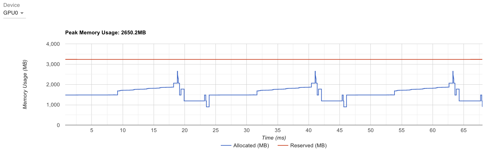
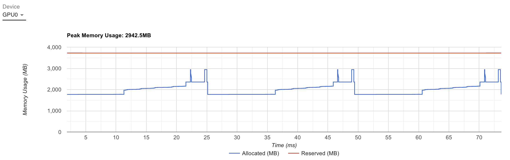
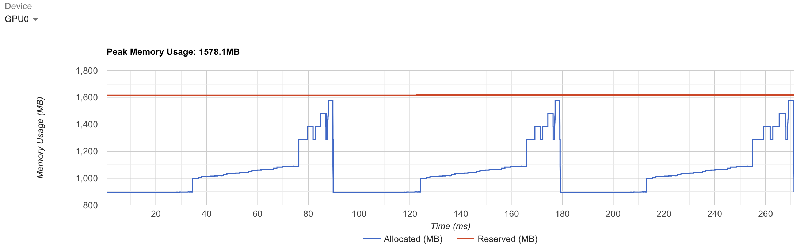
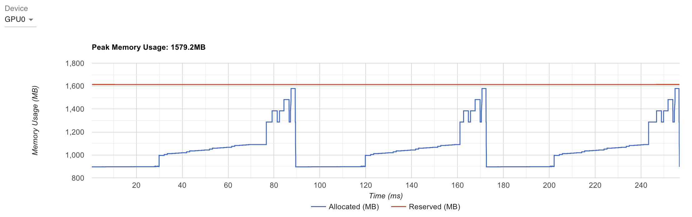

## References

- dmoe
    - megablocks
        - [moe.py](https://github.com/databricks/megablocks/blob/main/megablocks/layers/moe.py)
        - [dmoe.py](https://github.com/databricks/megablocks/blob/main/megablocks/layers/lingua/dmoe.py#L18)
    - llm foundry
        - [layers/ffn.py](https://github.com/mosaicml/llm-foundry/blob/e6e74a24db234a74010f64f72cbd15bfa4ffda1c/llmfoundry/models/layers/ffn.py#L470-L509)
        - [test_dmoe.py](https://github.com/mosaicml/llm-foundry/blob/e6e74a24db234a74010f64f72cbd15bfa4ffda1c/tests/models/layers/test_dmoe.py#L71)
        - [moe init](https://github.com/mosaicml/llm-foundry/blob/e6e74a24db234a74010f64f72cbd15bfa4ffda1c/llmfoundry/models/utils/param_init_fns.py#L341-L404)
    - olmo
        - [olmoe](https://github.com/allenai/OLMo/blob/sewon-olmoe/olmo/model.py#L680-L690)
        - [parallelism](https://github.com/allenai/OLMo/blob/sewon-olmoe/scripts/train.py#L188-L225)
        - [profiler](https://github.com/allenai/OLMo/blob/sewon-olmoe/olmo/train.py#L1225-L1262)

    - megatron integration
        - [megatron PR 1](https://github.com/NVIDIA/Megatron-LM/pull/287)
        - [megatron PR 2](https://github.com/NVIDIA/Megatron-LM/pull/288)
        - [stanford-futuredata/Megatron-LM](https://github.com/stanford-futuredata/Megatron-LM/tree/3a9e3d8de308e6f6398b59d16a8bd7177374f121)

- torch native trainer references
    - [pytorch/torchtune](https://github.com/pytorch/torchtune)
    - [pytorch/torchtitan](https://github.com/pytorch/torchtitan)
        - [memory_profiler](https://github.com/pytorch/torchtitan/blob/main/docs/memory_profiler.md)

- megatron naive moe
    - [Megatron-LM/megatron/core/transformer/moe](https://github.com/NVIDIA/Megatron-LM/tree/main/megatron/core/transformer/moe)
    - [Megatron-LM/docs/llama_mistral.md](https://github.com/NVIDIA/Megatron-LM/blob/main/docs/llama_mistral.md)
    - [Megatron-LM/examples/export/ptq_and_trtllm_export](https://github.com/NVIDIA/Megatron-LM/tree/772faca1f8d5030621b738cbd8e8bb2d8d28f6e6/examples/export/ptq_and_trtllm_export)
    - [mixtral inference example](https://github.com/NVIDIA/Megatron-LM/tree/main/examples/mixtral)


## dist pdb tracer for debugging

- Installation

```bash
pip install megablocks==0.6.1
```

```bash
cd /path/to/dir/multiprocessing_pdb &&\
pip install -e .
```

- Usage

```python
from multiprocessing_pdb import MultiprocessingPdb
Tra = MultiprocessingPdb().set_trace

def dummy_code_block(...):
    Tra()
```


## run scripts for torch/nccl all to all comm

```bash
# cd /path/to/dir/lingua/dmoe
export LOCAL_RANK=0 &&\
export WORLD_SIZE=2 &&\
export MASTER_ADDR=node0 &&\
export MASTER_PORT=23458 &&\
torchrun --nproc_per_node=$WORLD_SIZE --master_addr=$MASTER_ADDR --master_port=$MASTER_PORT \
test_all_to_all.py
```

```python
rank: 0, world size: 2
rank: 1, world size: 2

    (input) (rank 1): [tensor([0, 1, 2, 3, 4], device='cuda:0'), tensor([10, 11, 12, 13, 14, 15], device='cuda:1')]
    (input_splits) (rank 1): [[2, 3], [3, 3]]
    (input_splitted) (rank 1): [tensor([10, 11, 12], device='cuda:1'), tensor([13, 14, 15], device='cuda:1')]
    (output before all_to_all) (rank 1): [tensor([0, 0, 0], device='cuda:1'), tensor([0, 0, 0], device='cuda:1')]

    (input) (rank 0): [tensor([0, 1, 2, 3, 4], device='cuda:0'), tensor([10, 11, 12, 13, 14, 15], device='cuda:1')]
    (input_splits) (rank 0): [[2, 3], [3, 3]]
    (input_splitted) (rank 0): [tensor([0, 1], device='cuda:0'), tensor([2, 3, 4], device='cuda:0')]
    (output before all_to_all) (rank 0): [tensor([0, 0], device='cuda:0'), tensor([0, 0, 0], device='cuda:0')]
    
    (output after all_to_all) (rank 1): [tensor([2, 3, 4], device='cuda:1'), tensor([13, 14, 15], device='cuda:1')]
    (output after all_to_all) (rank 0): [tensor([0, 1], device='cuda:0'), tensor([10, 11, 12], device='cuda:0')]
```


## run scripts for torch native parallelism

### FSDP

```bash
export LOCAL_RANK=0 &&\
export WORLD_SIZE=2 &&\
export MASTER_ADDR=node0 &&\
export MASTER_PORT=23458
```

```bash
# cd /path/to/dir/lingua/dmoe
export DP=1 &&\
export SHARD=2 &&\
export TP=1
torchrun --nproc_per_node=$WORLD_SIZE --master_addr=$MASTER_ADDR --master_port=$MASTER_PORT \
test_mesh.py
```

<details>

```python
    mesh_3d: DeviceMesh('cuda', [[[0], [1]]], mesh_dim_names=('replicate', 'shard', 'tp'))
    fsdp_mesh: DeviceMesh('cuda', [[0, 1]], mesh_dim_names=('replicate', 'shard'))
    tp_mesh: DeviceMesh('cuda', [0], mesh_dim_names=('tp',))
    replicate_group: <torch.distributed.distributed_c10d.ProcessGroup object at 0x7fd5641c87b0>
    shard_group: <torch.distributed.distributed_c10d.ProcessGroup object at 0x7fd5641c8670>
    tp_group: <torch.distributed.distributed_c10d.ProcessGroup object at 0x7fd5641c8530>
    

    model: FullyShardedDataParallel(
  (_fsdp_wrapped_module): Transformer(
    (model): ModuleDict(
      (wte): Embedding(50257, 1024)
      (h): ModuleList(
        (0-3): 4 x ResidualBlock(
          (ln1): LayerNorm()
          (attn): Attention(
            (q_proj): Linear(in_features=1024, out_features=1024, bias=False)
            (k_proj): Linear(in_features=1024, out_features=1024, bias=False)
            (v_proj): Linear(in_features=1024, out_features=1024, bias=False)
            (o_proj): Linear(in_features=1024, out_features=1024, bias=False)
          )
          (ln2): LayerNorm()
          (mlp): MLP(
            (ffn1): Linear(in_features=1024, out_features=4096, bias=False)
            (act): GELU(approximate='none')
            (ffn2): Linear(in_features=4096, out_features=1024, bias=False)
          )
        )
      )
      (ln): LayerNorm()
    )
    (lm_head): Linear(in_features=1024, out_features=50257, bias=False)
  )
)
    
0th step loss: 11.174592018127441
1th step loss: 0.5179086923599243
2th step loss: 16.637855529785156
3th step loss: 15.226019859313965
4th step loss: 11.38132095336914
5th step loss: 10.103214263916016
```

</details>




### just DP

<details>

```bash
export DP=2 &&\
export SHARD=1 &&\
export TP=1
torchrun --nproc_per_node=$WORLD_SIZE --master_addr=$MASTER_ADDR --master_port=$MASTER_PORT \
test_mesh.py
```

```python
    mesh_3d: DeviceMesh('cuda', [[[0]], [[1]]], mesh_dim_names=('replicate', 'shard', 'tp'))
    fsdp_mesh: DeviceMesh('cuda', [[0], [1]], mesh_dim_names=('replicate', 'shard'))
    tp_mesh: DeviceMesh('cuda', [0], mesh_dim_names=('tp',))
    replicate_group: <torch.distributed.distributed_c10d.ProcessGroup object at 0x7fd1787c0130>
    shard_group: <torch.distributed.distributed_c10d.ProcessGroup object at 0x7fd16dcc71b0>
    tp_group: <torch.distributed.distributed_c10d.ProcessGroup object at 0x7fd1787c0a30>
    
/mnt/chatbot30TB/shseo/venv/lingua/lib/python3.10/site-packages/torch/distributed/fsdp/_init_utils.py:444: UserWarning: FSDP is switching to use `NO_SHARD` instead of ShardingStrategy.HYBRID_SHARD since the world size is 1.
  warnings.warn(

    model: FullyShardedDataParallel(
  (_fsdp_wrapped_module): Transformer(
    (model): ModuleDict(
      (wte): Embedding(50257, 1024)
      (h): ModuleList(
        (0-3): 4 x ResidualBlock(
          (ln1): LayerNorm()
          (attn): Attention(
            (q_proj): Linear(in_features=1024, out_features=1024, bias=False)
            (k_proj): Linear(in_features=1024, out_features=1024, bias=False)
            (v_proj): Linear(in_features=1024, out_features=1024, bias=False)
            (o_proj): Linear(in_features=1024, out_features=1024, bias=False)
          )
          (ln2): LayerNorm()
          (mlp): MLP(
            (ffn1): Linear(in_features=1024, out_features=4096, bias=False)
            (act): GELU(approximate='none')
            (ffn2): Linear(in_features=4096, out_features=1024, bias=False)
          )
        )
      )
      (ln): LayerNorm()
    )
    (lm_head): Linear(in_features=1024, out_features=50257, bias=False)
  )
)
    
/mnt/chatbot30TB/shseo/venv/lingua/lib/python3.10/site-packages/torch/distributed/fsdp/_init_utils.py:444: UserWarning: FSDP is switching to use `NO_SHARD` instead of ShardingStrategy.HYBRID_SHARD since the world size is 1.
  warnings.warn(
0th step loss: 11.174592018127441
1th step loss: 0.5180912017822266
2th step loss: 16.640453338623047
3th step loss: 15.22722053527832
4th step loss: 11.383994102478027
5th step loss: 10.128301620483398
```

</details>




### TP

```bash
export DP=1 &&\
export SHARD=1 &&\
export TP=2
torchrun --nproc_per_node=$WORLD_SIZE --master_addr=$MASTER_ADDR --master_port=$MASTER_PORT \
test_mesh.py
```

<details>

```python
    mesh_3d: DeviceMesh('cuda', [[[0, 1]]], mesh_dim_names=('replicate', 'shard', 'tp'))
    fsdp_mesh: DeviceMesh('cuda', [[0]], mesh_dim_names=('replicate', 'shard'))
    tp_mesh: DeviceMesh('cuda', [0, 1], mesh_dim_names=('tp',))
    replicate_group: <torch.distributed.distributed_c10d.ProcessGroup object at 0x7f90901c01b0>
    shard_group: <torch.distributed.distributed_c10d.ProcessGroup object at 0x7f90901c1c30>
    tp_group: <torch.distributed.distributed_c10d.ProcessGroup object at 0x7f90901c1c70>
    

    model: Transformer(
  (model): ModuleDict(
    (wte): Embedding(50257, 1024)
    (h): ModuleList(
      (0-3): 4 x ResidualBlock(
        (ln1): LayerNorm()
        (attn): Attention(
          (q_proj): Linear(in_features=1024, out_features=1024, bias=False)
          (k_proj): Linear(in_features=1024, out_features=1024, bias=False)
          (v_proj): Linear(in_features=1024, out_features=1024, bias=False)
          (o_proj): Linear(in_features=1024, out_features=1024, bias=False)
        )
        (ln2): LayerNorm()
        (mlp): MLP(
          (ffn1): Linear(in_features=1024, out_features=4096, bias=False)
          (act): GELU(approximate='none')
          (ffn2): Linear(in_features=4096, out_features=1024, bias=False)
        )
      )
    )
    (ln): LayerNorm()
  )
  (lm_head): Linear(in_features=1024, out_features=50257, bias=False)
)
    
0th step loss: DTensor(local_tensor=11.174638748168945, device_mesh=DeviceMesh('cuda', [0, 1], mesh_dim_names=('tp',)), placements=(Replicate(),))
1th step loss: DTensor(local_tensor=0.5185606479644775, device_mesh=DeviceMesh('cuda', [0, 1], mesh_dim_names=('tp',)), placements=(Replicate(),))
2th step loss: DTensor(local_tensor=16.62112808227539, device_mesh=DeviceMesh('cuda', [0, 1], mesh_dim_names=('tp',)), placements=(Replicate(),))
3th step loss: DTensor(local_tensor=15.390058517456055, device_mesh=DeviceMesh('cuda', [0, 1], mesh_dim_names=('tp',)), placements=(Replicate(),))
4th step loss: DTensor(local_tensor=11.48178482055664, device_mesh=DeviceMesh('cuda', [0, 1], mesh_dim_names=('tp',)), placements=(Replicate(),))
5th step loss: DTensor(local_tensor=9.973380088806152, device_mesh=DeviceMesh('cuda', [0, 1], mesh_dim_names=('tp',)), placements=(Replicate(),))
```

</details>




### TP w/o loss parallel

<details>

```python
0th step loss: 11.174637794494629
1th step loss: 0.5185607075691223
2th step loss: 16.62110137939453
3th step loss: 15.38946533203125
4th step loss: 11.482044219970703
5th step loss: 9.972816467285156
```

</details>




## run scripts for dmoe test (WIP)

```bash
# cd /path/to/dir/lingua/dmoe
export LOCAL_RANK=0 &&\
export WORLD_SIZE=2 &&\
export MASTER_ADDR=node0 &&\
export MASTER_PORT=23458 &&\
torchrun --nproc_per_node=$WORLD_SIZE --master_addr=$MASTER_ADDR --master_port=$MASTER_PORT \
test_dmoe.py
```

there is a bug