# Status

## some notes

- currently there is fsdp integration issue with dmoe and shampoo. 
- and MFU of shampoo sucks (maybe my skill issue)

## TODO (Ongoing)

- [x] test run
- [x] [muP](https://arxiv.org/abs/2203.03466)
- [x] fused kernel patch
    - TBD) fused ce dtensor issue
- [x] logger
    - [x] activation norm 
        - already exists
    - [x] grad norm
        - already exists
    - [x] param norm 
        - already exists
- [ ] enabling [Megablocks Dropless MoE (dMoE)](https://arxiv.org/abs/2211.15841) in trainer
    - [x] test dmoe with naive parallelism
    - [ ] with fsdp
    - [ ] implement EP with fsdp
- [ ] enabling [disttributed shampoo](https://arxiv.org/abs/2309.06497) in trainer
    - [x] with fsdp
        - but it does not work in lingua app (...?)
            - resolved by removing `init_weights` in model's init method
    - [ ] improving MFU

## additional TODO

- [ ] [qknorm](https://arxiv.org/abs/2302.05442)
    - [x] impl and test
    - [ ] sweep
- [ ] [residual post norm](https://arxiv.org/abs/2111.09883) (swin, chameleon, gemma)
    - [x] impl and test
    - [x] sweep
- [ ] [nGPT](https://arxiv.org/abs/2410.01131)
    - [x] impl and test
    - [ ] sweep
- [ ] [residual value](https://arxiv.org/abs/2410.17897)
    - [x] impl and test
    - [ ] sweep

# example run

```bash
# create new venv
VENV_DIR=/path/to/dir/venv &&\
VENV_NAME=lingua &&\
python -m pip install --upgrade pip &&\
pip install virtualenv &&\
python -m virtualenv -p python3 $VENV_DIR/$VENV_NAME
```

```bash
VENV_DIR=/path/to/dir/venv &&\
VENV_NAME=lingua &&\
source $VENV_DIR/$VENV_NAME/bin/activate
```

```bash
# cd /path/to/dir/lingua
pip install -r requirements.txt
```

```bash
# cd /path/to/dir/lingua
# python ./setup/download_prepare_hf_data.py dclm_baseline_1.0
python ./setup/download_prepare_hf_data.py fineweb_edu_10bt
```

```bash
pip install wandb
wandb login
```

```bash
export WORLD_SIZE=2 &&\
export MASTER_ADDR=node0 &&\
export MASTER_PORT=23458

export CONFIG=llama_1B
export DUMP_DIR="exp_logs/assets/logs/test_${CONFIG}_world_${WORLD_SIZE}"
torchrun --nproc-per-node $WORLD_SIZE \
-m apps.main.train \
config=apps/main/configs/${CONFIG}.yaml
```

<details>

```python
node0:23440:23664 [0] NCCL INFO threadThresholds 8/8/64 | 16/8/64 | 512 | 512
node0:23440:23664 [0] NCCL INFO 24 coll channels, 24 collnet channels, 0 nvls channels, 32 p2p channels, 32 p2p channels per peer
node0:23441:23666 [1] NCCL INFO NCCL_WORK_FIFO_DEPTH set by environment to 4194304.
node0:23440:23664 [0] NCCL INFO NCCL_WORK_FIFO_DEPTH set by environment to 4194304.
node0:23441:23666 [1] NCCL INFO TUNER/Plugin: Failed to find ncclTunerPlugin_v2, using internal tuner instead.
node0:23440:23664 [0] NCCL INFO TUNER/Plugin: Failed to find ncclTunerPlugin_v2, using internal tuner instead.
node0:23441:23666 [1] NCCL INFO ncclCommInitRank comm 0x55d761db2df0 rank 1 nranks 2 cudaDev 1 nvmlDev 1 busId 16000 commId 0xb3609cbb6ba7a88a - Init COMPLETE
node0:23440:23664 [0] NCCL INFO ncclCommInitRank comm 0x563d5b2b3360 rank 0 nranks 2 cudaDev 0 nvmlDev 0 busId 10000 commId 0xb3609cbb6ba7a88a - Init COMPLETE
1: INFO    24-10-19 18:46:56.490658 - 0:00:07 - Model size: 1,809,946,624 total parameters
0: INFO    24-10-19 18:46:56.491630 - 0:00:07 - Model size: 1,809,946,624 total parameters
1: INFO    24-10-19 18:46:56.492031 - 0:00:07 - GPU capacity: NVIDIA A100-SXM4-80GB (1) with 79.33GiB memory
0: INFO    24-10-19 18:46:56.492830 - 0:00:07 - GPU capacity: NVIDIA A100-SXM4-80GB (0) with 79.33GiB memory
1: INFO    24-10-19 18:46:56.494848 - 0:00:07 - GPU memory usage: NVIDIA A100-SXM4-80GB (1): 79.32501220703125 GiB capacity, 4.224609375 GiB peak, 5.325696470079506% peak
1: INFO    24-10-19 18:46:56.494932 - 0:00:07 - Starting build of optimizer...
1: INFO    24-10-19 18:46:56.496116 - 0:00:07 - Done with build of optimizer.
0: INFO    24-10-19 18:46:56.496769 - 0:00:07 - GPU memory usage: NVIDIA A100-SXM4-80GB (0): 79.32501220703125 GiB capacity, 4.224609375 GiB peak, 5.325696470079506% peak
0: INFO    24-10-19 18:46:56.496857 - 0:00:07 - Starting build of optimizer...
0: INFO    24-10-19 18:46:56.497909 - 0:00:07 - Done with build of optimizer.
0: INFO    24-10-19 18:46:56.508740 - 0:00:07 - Async dataloader started
0: INFO    24-10-19 18:46:56.509566 - 0:00:07 - Profiling active.  Traces will be saved at exp_logs/assets/logs/test_llama_1B_world_2/profiling
1: INFO    24-10-19 18:46:56.509680 - 0:00:07 - Async dataloader started
0: INFO    24-10-19 18:46:56.510721 - 0:00:07 - Starting MemSnapshotsProfilerWandb profiler...
1: INFO    24-10-19 18:46:56.510869 - 0:00:07 - Profiling active.  Traces will be saved at exp_logs/assets/logs/
1: INFO    24-10-19 18:46:56.509680 - 0:00:07 - Async dataloader started
0: INFO    24-10-19 18:46:56.510721 - 0:00:07 - Starting MemSnapshotsProfilerWandb profiler...
1: INFO    24-10-19 18:46:56.510869 - 0:00:07 - Profiling active.  Traces will be saved at exp_logs/assets/logs/test_llama_1B_world_2/profiling
1: INFO    24-10-19 18:46:56.511857 - 0:00:07 - Starting MemSnapshotsProfilerWandb profiler...
1: INFO    24-10-19 18:47:29.439328 - 0:00:40 - garbage collection
0: INFO    24-10-19 18:47:29.632364 - 0:00:40 - garbage collection
1: INFO    24-10-19 18:47:38.013589 - 0:00:49 - step: 1  acc: 0  loss: 12.2048  grad: 1.06e+01  flops: 4.25e+12  wps: 3.95e+02  iter:  8.4191  data: 32.8857  lr: 0.00e+00  mem: 51%  pow: 92.494 W
0: INFO    24-10-19 18:47:38.013923 - 0:00:49 - step: 1  acc: 0  loss: 12.2087  grad: 1.06e+01  flops: 4.25e+12  wps: 3.95e+02  iter:  8.2273  data: 33.1016  lr: 0.00e+00  mem: 51%  pow: 96.192 W
1: INFO    24-10-19 18:47:38.910772 - 0:00:50 - step: 2  acc: 0  loss: 12.1832  grad: 1.08e+01  flops: 1.97e+14  wps: 1.84e+04  iter:  0.8908  data: 0.001  lr: 6.00e-07  mem: 59%  pow: 392.956 W
0: INFO    24-10-19 18:47:38.911112 - 0:00:50 - step: 2  acc: 0  loss: 12.2032  grad: 1.08e+01  flops: 1.97e+14  wps: 1.83e+04  iter:  0.8907  data: 0.0015  lr: 6.00e-07  mem: 59%  pow: 398.257 W
1: INFO    24-10-19 18:47:39.823351 - 0:00:51 - step: 3  acc: 0  loss: 12.1364  grad: 1.00e+01  flops: 1.96e+14  wps: 1.82e+04  iter:  0.8975  data: 0.0009  lr: 1.20e-06  mem: 59%  pow: 393.815 W
0: INFO    24-10-19 18:47:39.823625 - 0:00:51 - step: 3  acc: 0  loss: 12.1798  grad: 1.00e+01  flops: 1.96e+14  wps: 1.82e+04  iter:   0.898  data: 0.0014  lr: 1.20e-06  mem: 59%  pow: 391.807 W
1: INFO    24-10-19 18:47:40.724381 - 0:00:51 - Shutting down MemSnapshotsProfilerWandb profiler...

...
```

```
[Alignment-Learning#15.202] tmp@node0:/tmp$ tree -L 3
.
├── checkpoints
├── config.yaml
├── metrics.jsonl
├── profiling
│   ├── memory_trace_plot
│   │   ├── 000004_node0_23440.html
│   │   └── 000004_node0_23441.html
│   └── profile_CPU_CUDA_000104
│       ├── node0_23440.1729363752450987095.pt.trace.json.gz
│       └── node0_23441.1729363752459155825.pt.trace.json.gz
└── train.log
```

</details>


# muP and muTransfer

## coord check using mup native codes

### example code

<details>

```python
# cd /path/to/dir/lingua
from mup.run_coord_check import *
args = {
    'loglog': True, # log 2 plot
    'nseeds': 5, # to reduce varaince
    'lr': 1e-2, # large enough lr
    'vary_nhead': True,
    'optimizer': 'customized_adamw',
    'nsteps': 5,

    'mup': True, # muP or SP
    # 'mup': False,

    'gqa': True, # if GQA is set true, num kv_head is 4 times small than num q_head
    # 'gqa': False,

    # 'qk_norm': True,
    'qk_norm': False,
    
    # 'residual_post_norm': True,
    'residual_post_norm': False,
}

## for nGPT
args['mup'] = False
args['qk_norm'] = False
args['residual_post_norm'] = False
args['ngpt'] = True

opt_args = {
    'weight_decay': 0.01, 
    'adam_beta1': 0.9, 
    'adam_beta2': 0.95,
}
args.update(opt_args)
plot_coord_check(**args)
```

</details>

### SP

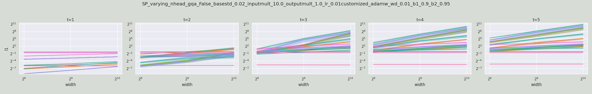

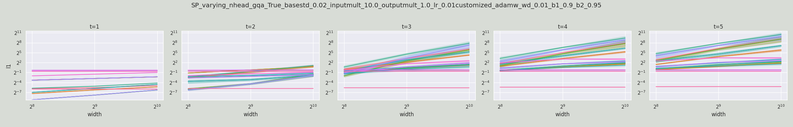

### muP

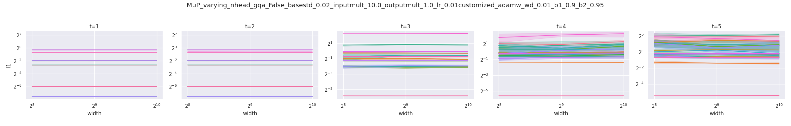

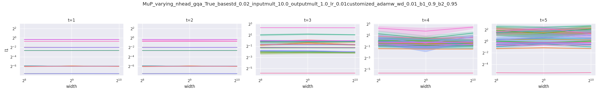

### muP with qknorm and residual post norm for better stability

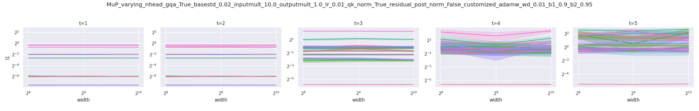

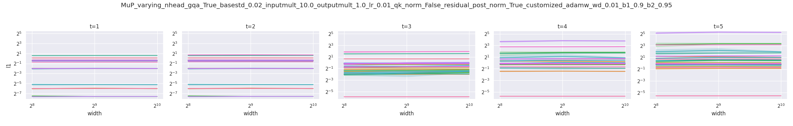

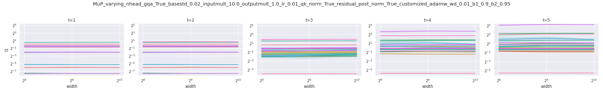

### nGPT (WIP)

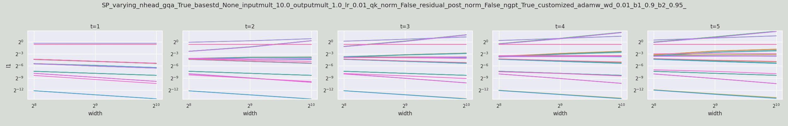


## coord check using lingua app

### bash command

<details>

```bash
# 1gpu test
export WORLD_SIZE=1
export MASTER_ADDR=node0
export MASTER_PORT=23458
export DP_DEGREE=1
export DP_SHARD_DEGREE=1
export TP_DEGREE=1
export FSDP_TYPE=no_shard
export COMPILE=true

# ## 2gpu fsdp test
# export WORLD_SIZE=2
# export MASTER_ADDR=node0
# export MASTER_PORT=23458
# export DP_DEGREE=1
# export DP_SHARD_DEGREE=2
# export TP_DEGREE=1
# export FSDP_TYPE=full_shard
# export COMPILE=true

# export MUP=false
# export INIT_BASE_STD=0
# export INIT_STD_FACTOR=global_depth

export MUP=true
export INIT_BASE_STD=0.04419 # 1/sqrt(512)
export INIT_STD_FACTOR=global_depth
# export BASE_N_HEADS=4
# export BASE_N_KV_HEADS=1
export BASE_N_HEADS=4
export BASE_N_KV_HEADS=4

export N_HEADS_=(4)
# export N_HEADS_=(4 8 16)

# export OPT_CLS_NAME="adamw"
export OPT_CLS_NAME="shampoo"

export LR=0.01
export WEIGHT_DECAY=0.0
# export WEIGHT_DECAY=0.1
export TRULY_DECOUPLED_WD=false
# export TRULY_DECOUPLED_WD=true
if [ "$TRULY_DECOUPLED_WD" = "true" ]; then
    export WEIGHT_DECAY=$(echo "scale=8; $LR*0.1" | bc)
fi

############################################################
export QK_NORM=false
# export QK_NORM=true
export RES_POST_NORM=false
# export RES_POST_NORM=true

############################################################
export NGPT=false

# export NGPT=true
# export QK_NORM=false
# export RES_POST_NORM=false
# export MUP=false
# export INIT_BASE_STD=0 # 1/sqrt(d_model)
# export INIT_STD_FACTOR=global_depth
# export WARMUP=0
# export WEIGHT_DECAY=0.0
############################################################

export STEPS=20
export WARMUP=0
export BSZ=2
export ACCUM=1

export PROBE_FREQ=1
export PROBE_WANDB=true
export PROFILING_RUN=false

############################################################
export CONFIG=llama_8B_proxy
export WANDB_PROJECT_NAME="lingua_sanity_check"
for N_HEADS in "${N_HEADS_[@]}"; do

    export N_HEADS=$N_HEADS
    export N_KV_HEADS=$N_HEADS
    # export N_KV_HEADS=$((N_HEADS / 4))

    CURRENT_TIME=$(date +'%Y%m%d_%H%M%S')
    WANDB_EXP_NAME="coord_check_${CURRENT_TIME}"
    export WANDB_EXP_NAME=$WANDB_EXP_NAME
    export DUMP_DIR="exp_logs/assets/logs/${WANDB_EXP_NAME}"
    torchrun --nproc-per-node $WORLD_SIZE \
    -m apps.main.train \
    config=apps/main/configs/${CONFIG}.yaml
done
```

</details>

### observations

- watch [my wandb logs](https://wandb.ai/seosh7039/lingua_sanity_check/workspace?nw=nwuserseosh7039)
- sanity check setup
    - start with multi head attention (MHA) setting, not grouped query attention (GQA)
    - all models have same depth (32 layers like other open weight 8b models)
    - head_dim=128 is fixed and varying number of heads 
    - 20 steps optimization and record
    - high enough lr=0.01 for sanity check (no warmup, cosine anneal to 0.1 of peak lr for realistic setting?)
    - adamw with betas=(0.9, 0.95), weight decay: 0.0
    - zero init query and readout layers
    - comparisons of SP baseline / muP baseline / mup + qknorm / mup + residual post norm (swin transformer / chameleon / gemma style)

- firstly you can check initial std of all layers thanks to lingua's probing feature.
    - you can check if you implement mup well and it looks good. 
    - vanilla fan-in varaiance for smallest proxy model, and `base_std/sqrt(width/base_width)` for wider models

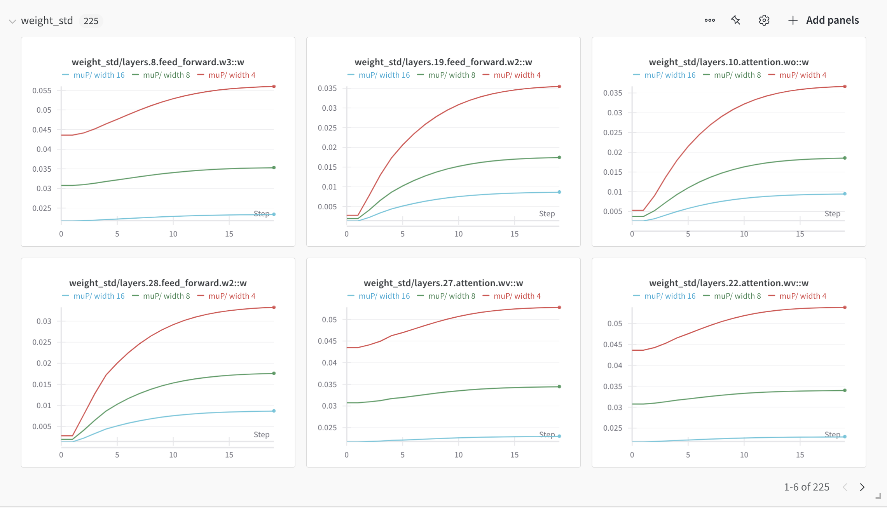

- you can check activation l2 norm of all layers
    - it doesnt seem blown up according to incresaed width 

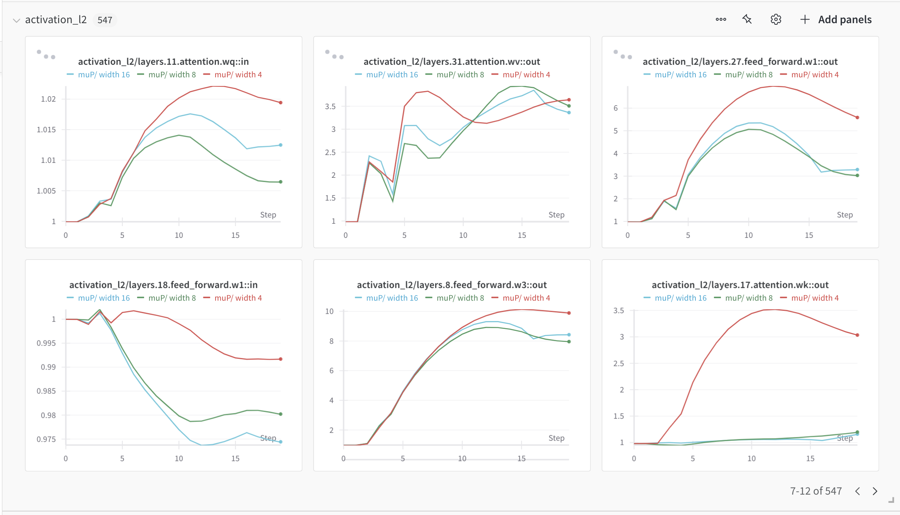
*Fig. muP FFN module layers*

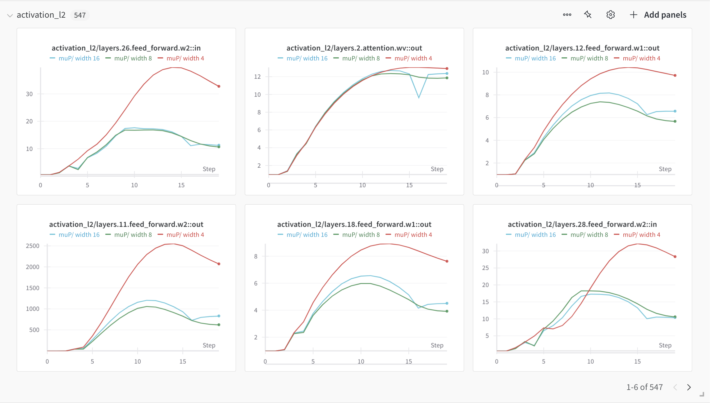
*Fig. muP attention module layers*

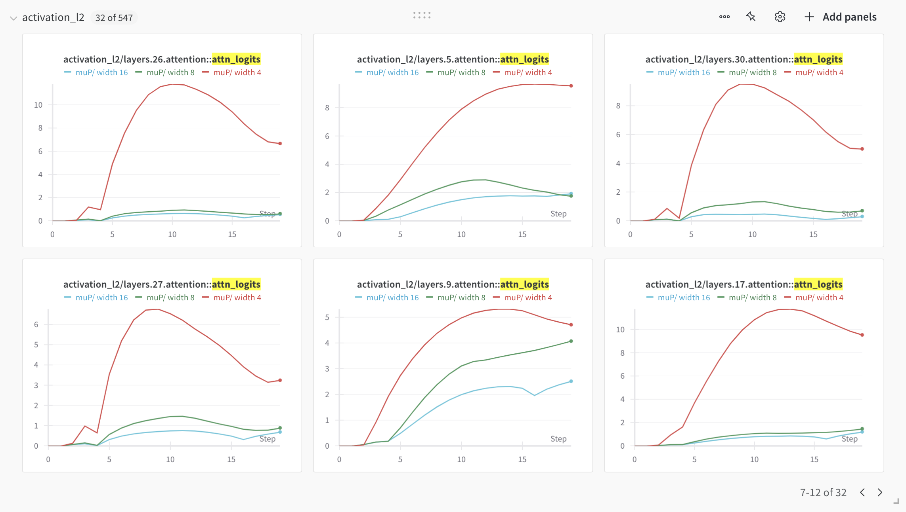
*Fig. muP attention logits*

- here's my previous coord check reference


*Fig. SP coordinate check*


*Fig. muP coordinate check*

- now let's check SP with lingua's probing tool
    - both of them, SP and muP started from same fan-in variance std, but they show different trajectories

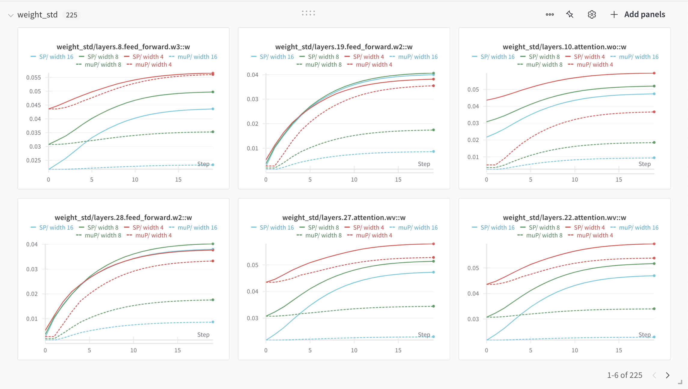

- and some layer's activation l2 norm starts to blow up in SP

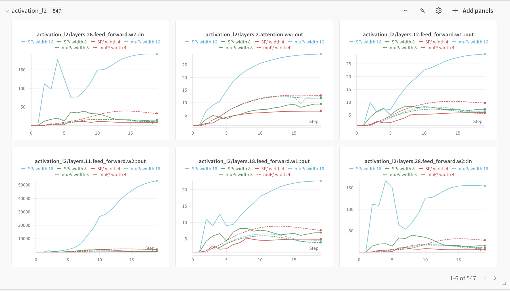

- attention logits looks bad too (especially wider model).

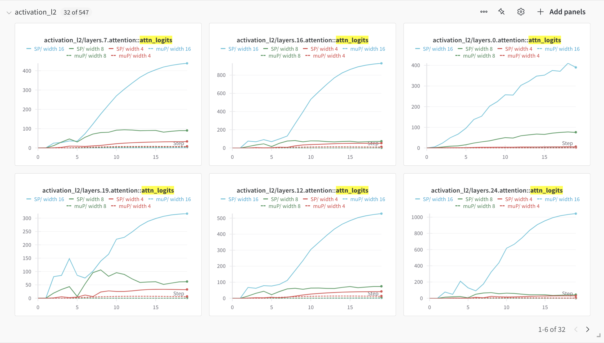

- now let's verify qk_norm and residual post norm is working or not
    - like [Scaling Vision Transformers to 22 Billion Parameters](https://arxiv.org/abs/2302.05442) said, you can check qk_norm relax l2 norm of attn logits a lot

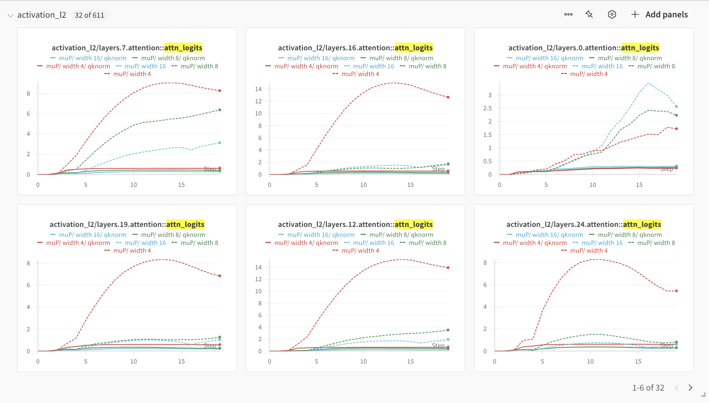

- and for residual post norm (`x = x + postnorm(ffn(prenorm(x)))`), idk why gemma use residual post norm clearly, but you can check l2 norm of final output of transformer residual blocks is very small compared to others (even qk_norm).
    - and i guess it can reduce [massive activation norms](https://arxiv.org/abs/2402.17762v1) so improve training stability a lot in large scale.

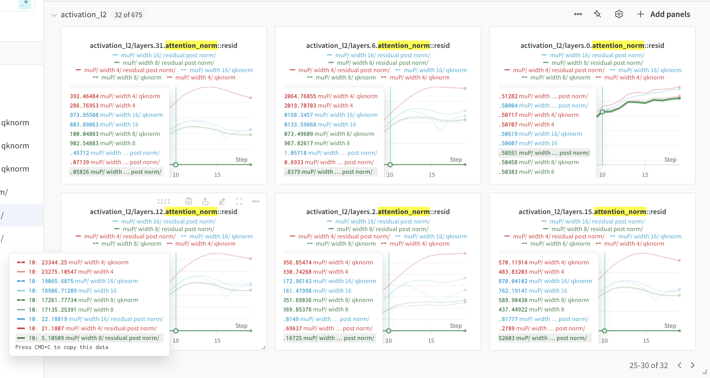

- (actviation value was fine in initialization but starts to blow up without residual post norm)

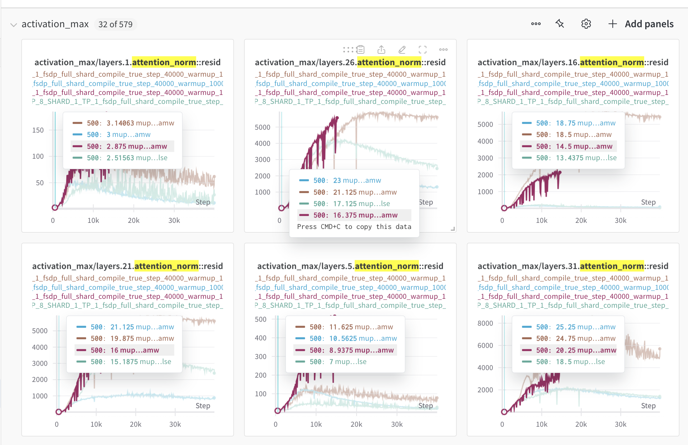

- p.s.) reference paper for l2 norm of residual branch matters in training stability
    - [Methods of improving LLM training stability](https://arxiv.org/abs/2410.16682)

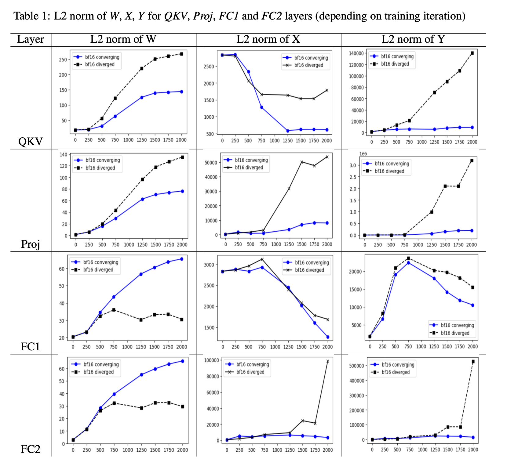

## muTransfer exp (actual training with fineweb 5B tokens)

### bash command

<details>

```bash
############################################################
export MUP=true
export INIT_STD_FACTOR=global_depth
export INIT_BASE_STD=0.04419 # 1/sqrt(512)
# export INIT_BASE_STD=0.0883 # 1/sqrt(128)

export BASE_N_HEADS=4
export BASE_N_KV_HEADS=1

export N_HEADS=4
export N_KV_HEADS=1
# export N_HEADS=8
# export N_KV_HEADS=2
# export N_HEADS=16
# export N_KV_HEADS=4
# export N_HEADS=32
# export N_KV_HEADS=8

############################################################
export STEPS=40000 # 4*4096*8*40000=5.24B tokens
export WARMUP=1000
if [ "$N_HEADS" -eq 32 ]; then
    export BSZ=2
    export ACCUM=2
else
    export BSZ=4
    export ACCUM=1
fi

############################################################

export RUN_TYPE="local_run"
# export RUN_TYPE="slurm_run"

if [ "$RUN_TYPE" = "local_run" ]; then
    ## local run
    export WORLD_SIZE=8
    export MASTER_ADDR=node0
    export MASTER_PORT=23458
        
    if [ "$N_HEADS" -eq 4 ]; then
        export DP_DEGREE=8
        export DP_SHARD_DEGREE=1
        export TP_DEGREE=1
        export FSDP_TYPE=no_shard
    elif [ "$N_HEADS" -eq 8 ] || [ "$N_HEADS" -eq 16 ]; then
        export DP_DEGREE=2
        export DP_SHARD_DEGREE=4
        export TP_DEGREE=1
        export FSDP_TYPE=full_shard
    elif [ "$N_HEADS" -eq 32 ]; then
        export DP_DEGREE=1
        export DP_SHARD_DEGREE=8
        export TP_DEGREE=1
        export FSDP_TYPE=full_shard
    fi

    export COMPILE=true
    # export COMPILE=false

    # ## for TP sanity check
    # export DP_DEGREE=4
    # export DP_SHARD_DEGREE=1
    # export TP_DEGREE=2

elif [ "$RUN_TYPE" = "slurm_run" ]; then
    ## slurn run 
    echo "TBC"
fi

############################################################
# # export OPT_CLS_NAME='adamw'
# export WEIGHT_DECAY=0.1
# export TRULY_DECOUPLED_WD=false
# # export TRULY_DECOUPLED_WD=true

export OPT_CLS_NAME='shampoo'
export WEIGHT_DECAY=0.00001
export TRULY_DECOUPLED_WD=false

############################################################
export QK_NORM=false
# export QK_NORM=true

export RES_POST_NORM=false
# export RES_POST_NORM=true

############################################################
export NGPT=false

# export NGPT=true
# export QK_NORM=false
# export RES_POST_NORM=false
# export MUP=false
# export INIT_BASE_STD=0 # 1/sqrt(d_model)
# export INIT_STD_FACTOR=global_depth
# export WARMUP=0
# export WEIGHT_DECAY=0.0

############################################################
export RESIDUAL_VALUE=false
# export RESIDUAL_VALUE=true

############################################################
# export USE_MOE=true
# export USE_DMOE=true
export USE_MOE=false
export USE_DMOE=false

############################################################
export PROBE_FREQ=100
export PROBE_WANDB=true
export PROFILING_RUN=false

############################################################
# LRS=(0.00391)
LRS=(0.00195)
# LRS=(0.00098)
# LRS=(0.00098 0.00195 0.00781)
# LRS=( # low resolution sweep / 2^-13 ~ 2^-4
#         0.000061 0.000122 0.00024 0.00049
#         0.00098 0.00195
#         0.00391 0.00781
#         0.01562 0.03125 0.0625
# )
# LRS=( # narrow range (only basin)
#         0.000122 0.00024 0.00049
#         0.00098 0.00195
#         0.00391 0.00781
#         0.01562 0.03125
# )
# LRS=( # narrow range (only basin)
#         0.00049 0.00098 
#         0.00195 0.00391
# )
# LRS=(0.00781 0.01562 0.03125 0.0625)
# LRS=( # high resolution sweep / 2^-13 ~ 2^-4
#         0.000061 0.000122 0.00024 0.00049
#         0.00098 0.00138 0.00195 0.00276
#         0.00391 0.00552 0.00781 0.01105
#         0.01562 0.03125 0.0625
# )

# ## for test
# LRS=(0.00195)
# export WORLD_SIZE=4
# export MASTER_ADDR=node0
# export MASTER_PORT=23458
# export DP_DEGREE=4
# export DP_SHARD_DEGREE=1
# export TP_DEGREE=1
# export FSDP_TYPE=no_shard
# export BSZ=4
# export ACCUM=2
# export MUP=true
# export INIT_BASE_STD=0.04419

############################################################
export CONFIG=llama_8B_proxy
export WANDB_PROJECT_NAME="lingua"
for LR in "${LRS[@]}"; do
    export LR=$LR
    if [ "$TRULY_DECOUPLED_WD" = "true" ]; then
        export WEIGHT_DECAY=$(echo "scale=8; $LR*0.1" | bc)
    fi

    WANDB_EXP_NAME="mup_${MUP}_nhead_${N_HEADS}_nkvhead_${N_KV_HEADS}_basenhead_${BASE_N_HEADS}_basenkvhead_${BASE_N_KV_HEADS}"
    WANDB_EXP_NAME="${WANDB_EXP_NAME}_world_${WORLD_SIZE}_DP_${DP_DEGREE}_SHARD_${DP_SHARD_DEGREE}_TP_${TP_DEGREE}_fsdp_${FSDP_TYPE}_compile_${COMPILE}"
    WANDB_EXP_NAME="${WANDB_EXP_NAME}_step_${STEPS}_warmup_${WARMUP}_bsz_${BSZ}_accum_${ACCUM}"
    WANDB_EXP_NAME="${WANDB_EXP_NAME}_lr_${LR}"
    WANDB_EXP_NAME="${WANDB_EXP_NAME}_qknorm_${QK_NORM}_resnorm_${RES_POST_NORM}"
    WANDB_EXP_NAME="${WANDB_EXP_NAME}_ngpt_${NGPT}_wd_${WEIGHT_DECAY}"
    WANDB_EXP_NAME="${WANDB_EXP_NAME}_optim_${OPT_CLS_NAME}"
    export WANDB_EXP_NAME=$WANDB_EXP_NAME
    export DUMP_DIR="exp_logs/assets/logs/${WANDB_EXP_NAME}"

    if [ "$RUN_TYPE" = "local_run" ]; then
        ## local run
        torchrun --nproc-per-node $WORLD_SIZE \
        -m apps.main.train \
        config=apps/main/configs/${CONFIG}.yaml
    elif [ "$RUN_TYPE" = "slurm_run" ]; then
        echo ""
        # ## slurm run
        # export SLURM_NNODES=1
        # export PARTITION="batch-exp"
        # bash ./scripts/run_slurm.sh
    fi
done
```

</details>

### observations (ongoing)

- LR sweep (24. 11. 15 intermediate result)
    - pls read the notes on plot
    - it seems residual post norm reduces lr sensitivity lil bit in smallest scale, but there is some performance degradation
    - but i think it could be different in large scale pre-training because of stability and precision.
        - like weight decay contribution to better performance is due to stability improvement in modern llm regime
            - [Why Do We Need Weight Decay in Modern Deep Learning?](https://arxiv.org/abs/2310.04415)
    - residual value works in 400M size /5B tokens scale (almost always better)
    - nGPT is trained well but i think it shows high lr sensitivity and not superior performance compared to vanilla muP baselines

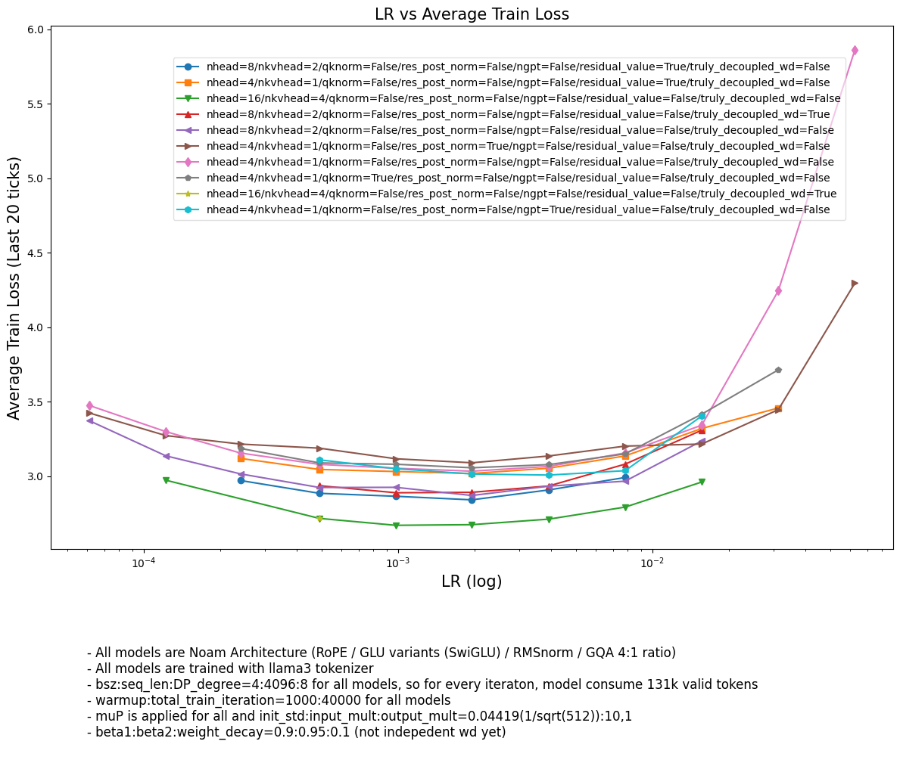

- for nGPT, warmup and weight decay set as 0.0
    - while baseline (muP) used 1k warmup and 0.1 wd
- both of them, nGPT and muP baseline are trained with 40k adamw update (nearly 5B tokens)
- i guess muP gaurantee maximal update for every layers theoretically, there are not huge gap or nGPT show better performance in large scale or when baseline use higher warmup steps

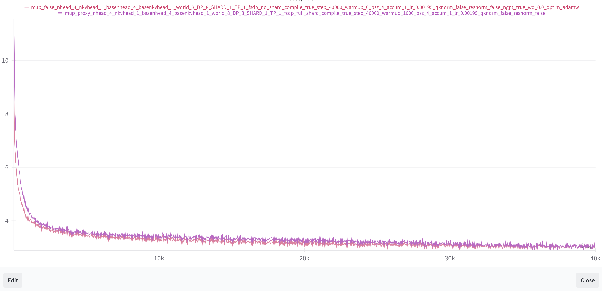

- wider is always better with muP

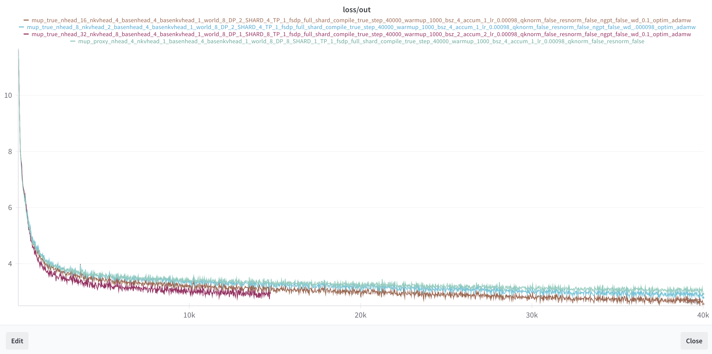

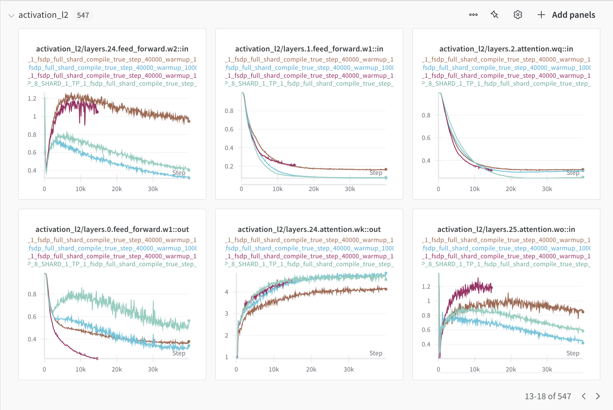

- MFU looks good in 1node (but i didnt care small scale models's setup much because i want to use same batch size for every widths)

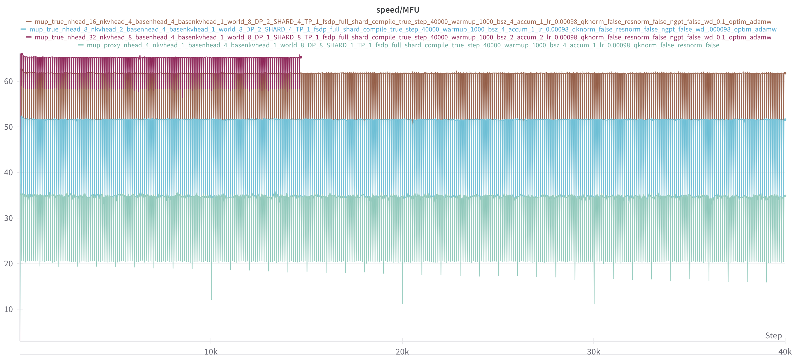

### shampoo vibe check

- shampoo looks slightly better than adamw? in 0.00195 lr
- MFU sucks with FSDP2

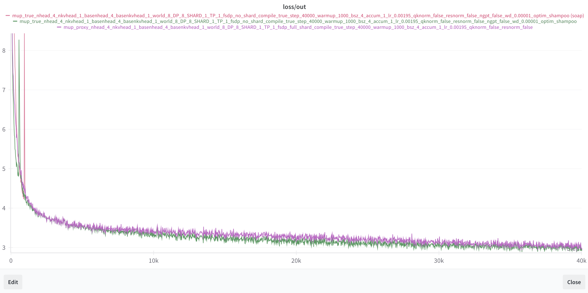

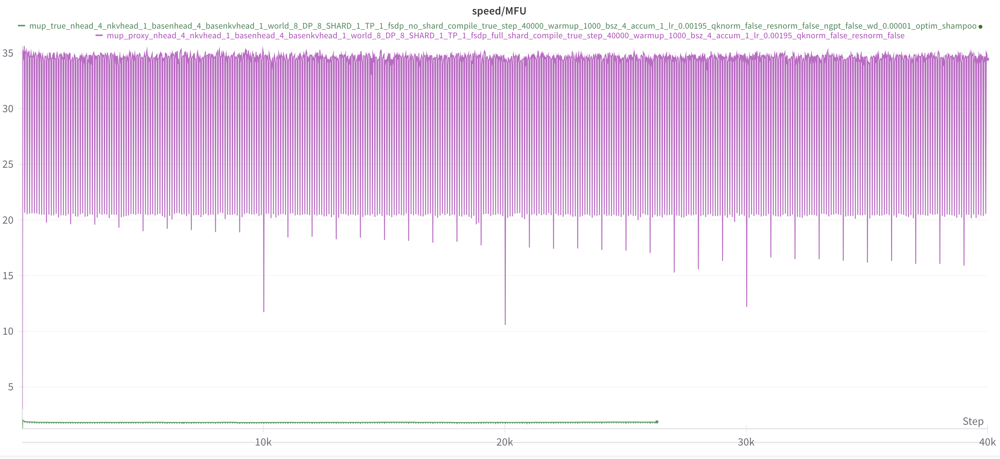

- here's my code

```python
## arguments
shampoo_beta2: float = 0.999
shampoo_epsilon: float = 1e-12
shampoo_max_preconditioner_dim: int = 8192
shampoo_start_preconditioning_step: int = -1
shampoo_precondition_frequency: int = 20

def get_optimizer(model, args, model_args, dist_args, device_mesh):

    from distributed_shampoo.distributed_shampoo import DistributedShampoo
    from distributed_shampoo.shampoo_types import AdamGraftingConfig, FullyShardShampooConfig, HSDPShampooConfig
    from distributed_shampoo.utils.shampoo_fsdp_utils import compile_fsdp_parameter_metadata
    opt_cls = DistributedShampoo

    def new_group():
        new_g = {
            'lr': args.lr,
            'weight_decay': args.weight_decay,
        }
        new_g['params'] = []
        return new_g
    def new_group_():
        new_g = {
            'lr': args.lr,
            'weight_decay': 0.,
        }
        new_g['params'] = []
        return new_g

    no_decay_name_list = ["bias", "norm", "scaler"]
    optimizer_grouped_parameters = []

    opt_kwargs = {
        'betas': (args.beta1, args.shampoo_beta2),
        'epsilon': args.shampoo_epsilon,
        'grafting_config': AdamGraftingConfig(
            # beta2=args.beta2,
            beta2=args.shampoo_beta2,
            epsilon=args.epsilon,
        ),
        'use_decoupled_weight_decay': True,
        'max_preconditioner_dim': args.shampoo_max_preconditioner_dim,
        'start_preconditioning_step': args.shampoo_start_preconditioning_step,
        'precondition_frequency': args.shampoo_precondition_frequency,
    }

    ## for fully_shard (fsdp2)
    opt_kwargs['distributed_config'] = FullyShardShampooConfig()

    default_group = new_group()
    no_decay_group = new_group_() # don't decay bias an layernorm

    for n, p in model.named_parameters():
        if p.requires_grad:
            if any(ndnl in n for ndnl in no_decay_name_list):
                # print(f'{n} is in {no_decay_name_list}, so wd is set as 0')
                no_decay_group['params'].append(p)
            else:
                default_group['params'].append(p)

    if truly_decoupled_wd:
        default_group['weight_decay'] /= default_group['lr'] 

    optimizer_grouped_parameters.extend(
        [default_group] 
        + [no_decay_group]
    )

    return opt_cls(
        optimizer_grouped_parameters, 
        **opt_kwargs,
    )
```