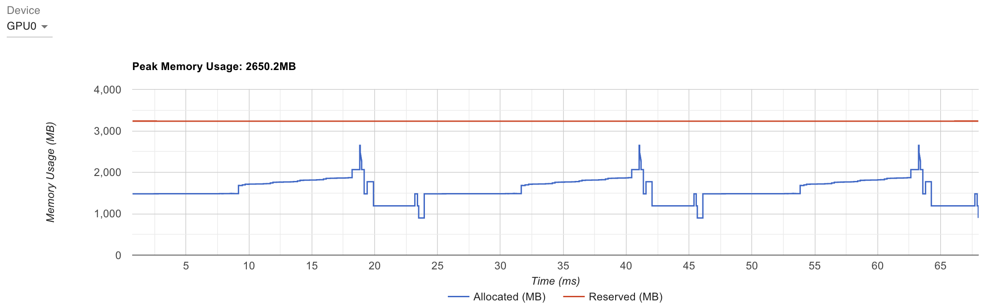
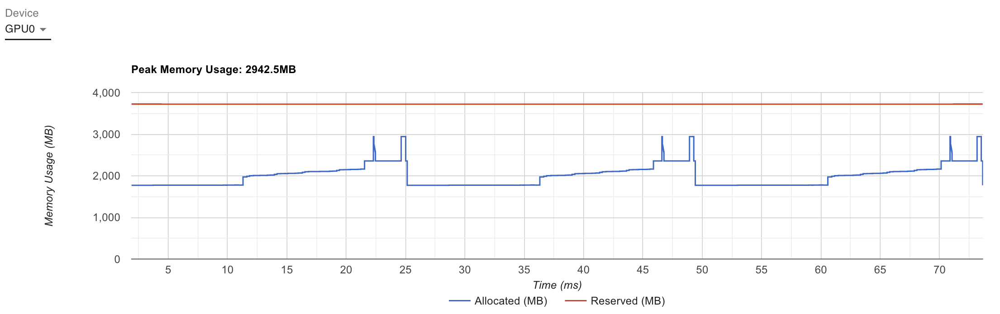
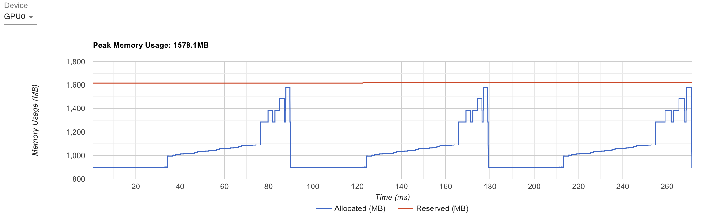
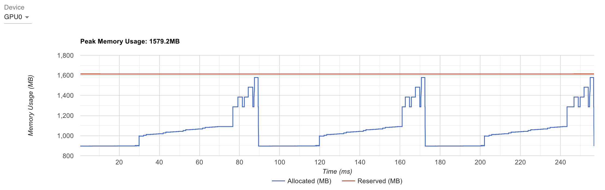

# torch native parallelism

## dist pdb tracer for debugging

```python
from multiprocessing_pdb import MultiprocessingPdb
Tra = MultiprocessingPdb().set_trace

def dummy_code_block(...):
    Tra()
```

## make sure your dist setting is correct

```bash
export WORLD_SIZE=2 &&\
export MASTER_ADDR=node0 &&\
export MASTER_PORT=23459
torchrun --nproc_per_node=$WORLD_SIZE --master_addr=$MASTER_ADDR --master_port=$MASTER_PORT \
utils.py
```


## run scripts for torch/nccl all to all comm

```bash
# cd /path/to/dir/lingua/exp_srcs
export WORLD_SIZE=2 &&\
export MASTER_ADDR=node0 &&\
export MASTER_PORT=23459 &&\
torchrun --nproc_per_node=$WORLD_SIZE --master_addr=$MASTER_ADDR --master_port=$MASTER_PORT \
test_all_to_all.py
```

```python
rank: 0, world size: 2
rank: 1, world size: 2

    (input) (rank 1): [tensor([0, 1, 2, 3, 4], device='cuda:0'), tensor([10, 11, 12, 13, 14, 15], device='cuda:1')]
    (input_splits) (rank 1): [[2, 3], [3, 3]]
    (input_splitted) (rank 1): [tensor([10, 11, 12], device='cuda:1'), tensor([13, 14, 15], device='cuda:1')]
    (output before all_to_all) (rank 1): [tensor([0, 0, 0], device='cuda:1'), tensor([0, 0, 0], device='cuda:1')]

    (input) (rank 0): [tensor([0, 1, 2, 3, 4], device='cuda:0'), tensor([10, 11, 12, 13, 14, 15], device='cuda:1')]
    (input_splits) (rank 0): [[2, 3], [3, 3]]
    (input_splitted) (rank 0): [tensor([0, 1], device='cuda:0'), tensor([2, 3, 4], device='cuda:0')]
    (output before all_to_all) (rank 0): [tensor([0, 0], device='cuda:0'), tensor([0, 0, 0], device='cuda:0')]
    
    (output after all_to_all) (rank 1): [tensor([2, 3, 4], device='cuda:1'), tensor([13, 14, 15], device='cuda:1')]
    (output after all_to_all) (rank 0): [tensor([0, 1], device='cuda:0'), tensor([10, 11, 12], device='cuda:0')]
```


## 2d-3d parallelism test

### FSDP

```bash
export WORLD_SIZE=2 &&\
export MASTER_ADDR=node0 &&\
export MASTER_PORT=23459
```

```bash
# cd /path/to/dir/lingua/exp_srcs
export DP=1 &&\
export SHARD=2 &&\
export TP=1
torchrun --nproc_per_node=$WORLD_SIZE --master_addr=$MASTER_ADDR --master_port=$MASTER_PORT \
test_mesh.py
```

<details>

```python
    mesh_3d: DeviceMesh('cuda', [[[0], [1]]], mesh_dim_names=('replicate', 'shard', 'tp'))
    fsdp_mesh: DeviceMesh('cuda', [[0, 1]], mesh_dim_names=('replicate', 'shard'))
    tp_mesh: DeviceMesh('cuda', [0], mesh_dim_names=('tp',))
    replicate_group: <torch.distributed.distributed_c10d.ProcessGroup object at 0x7fd5641c87b0>
    shard_group: <torch.distributed.distributed_c10d.ProcessGroup object at 0x7fd5641c8670>
    tp_group: <torch.distributed.distributed_c10d.ProcessGroup object at 0x7fd5641c8530>
    

    model: FullyShardedDataParallel(
  (_fsdp_wrapped_module): Transformer(
    (model): ModuleDict(
      (wte): Embedding(50257, 1024)
      (h): ModuleList(
        (0-3): 4 x ResidualBlock(
          (ln1): LayerNorm()
          (attn): Attention(
            (q_proj): Linear(in_features=1024, out_features=1024, bias=False)
            (k_proj): Linear(in_features=1024, out_features=1024, bias=False)
            (v_proj): Linear(in_features=1024, out_features=1024, bias=False)
            (o_proj): Linear(in_features=1024, out_features=1024, bias=False)
          )
          (ln2): LayerNorm()
          (mlp): MLP(
            (ffn1): Linear(in_features=1024, out_features=4096, bias=False)
            (act): GELU(approximate='none')
            (ffn2): Linear(in_features=4096, out_features=1024, bias=False)
          )
        )
      )
      (ln): LayerNorm()
    )
    (lm_head): Linear(in_features=1024, out_features=50257, bias=False)
  )
)
    
0th step loss: 11.174592018127441
1th step loss: 0.5179086923599243
2th step loss: 16.637855529785156
3th step loss: 15.226019859313965
4th step loss: 11.38132095336914
5th step loss: 10.103214263916016
```

</details>




### DP only

```bash
export DP=2 &&\
export SHARD=1 &&\
export TP=1
torchrun --nproc_per_node=$WORLD_SIZE --master_addr=$MASTER_ADDR --master_port=$MASTER_PORT \
test_mesh.py
```

<details>

```python
    mesh_3d: DeviceMesh('cuda', [[[0]], [[1]]], mesh_dim_names=('replicate', 'shard', 'tp'))
    fsdp_mesh: DeviceMesh('cuda', [[0], [1]], mesh_dim_names=('replicate', 'shard'))
    tp_mesh: DeviceMesh('cuda', [0], mesh_dim_names=('tp',))
    replicate_group: <torch.distributed.distributed_c10d.ProcessGroup object at 0x7fd1787c0130>
    shard_group: <torch.distributed.distributed_c10d.ProcessGroup object at 0x7fd16dcc71b0>
    tp_group: <torch.distributed.distributed_c10d.ProcessGroup object at 0x7fd1787c0a30>
    
/path/to/dir/venv/lingua/lib/python3.10/site-packages/torch/distributed/fsdp/_init_utils.py:444: UserWarning: FSDP is switching to use `NO_SHARD` instead of ShardingStrategy.HYBRID_SHARD since the world size is 1.
  warnings.warn(

    model: FullyShardedDataParallel(
  (_fsdp_wrapped_module): Transformer(
    (model): ModuleDict(
      (wte): Embedding(50257, 1024)
      (h): ModuleList(
        (0-3): 4 x ResidualBlock(
          (ln1): LayerNorm()
          (attn): Attention(
            (q_proj): Linear(in_features=1024, out_features=1024, bias=False)
            (k_proj): Linear(in_features=1024, out_features=1024, bias=False)
            (v_proj): Linear(in_features=1024, out_features=1024, bias=False)
            (o_proj): Linear(in_features=1024, out_features=1024, bias=False)
          )
          (ln2): LayerNorm()
          (mlp): MLP(
            (ffn1): Linear(in_features=1024, out_features=4096, bias=False)
            (act): GELU(approximate='none')
            (ffn2): Linear(in_features=4096, out_features=1024, bias=False)
          )
        )
      )
      (ln): LayerNorm()
    )
    (lm_head): Linear(in_features=1024, out_features=50257, bias=False)
  )
)
    
/path/to/dir/venv/lingua/lib/python3.10/site-packages/torch/distributed/fsdp/_init_utils.py:444: UserWarning: FSDP is switching to use `NO_SHARD` instead of ShardingStrategy.HYBRID_SHARD since the world size is 1.
  warnings.warn(
0th step loss: 11.174592018127441
1th step loss: 0.5180912017822266
2th step loss: 16.640453338623047
3th step loss: 15.22722053527832
4th step loss: 11.383994102478027
5th step loss: 10.128301620483398
```

</details>




### TP only

```bash
export DP=1 &&\
export SHARD=1 &&\
export TP=2
torchrun --nproc_per_node=$WORLD_SIZE --master_addr=$MASTER_ADDR --master_port=$MASTER_PORT \
test_mesh.py
```

<details>

```python
    mesh_3d: DeviceMesh('cuda', [[[0, 1]]], mesh_dim_names=('replicate', 'shard', 'tp'))
    fsdp_mesh: DeviceMesh('cuda', [[0]], mesh_dim_names=('replicate', 'shard'))
    tp_mesh: DeviceMesh('cuda', [0, 1], mesh_dim_names=('tp',))
    replicate_group: <torch.distributed.distributed_c10d.ProcessGroup object at 0x7f90901c01b0>
    shard_group: <torch.distributed.distributed_c10d.ProcessGroup object at 0x7f90901c1c30>
    tp_group: <torch.distributed.distributed_c10d.ProcessGroup object at 0x7f90901c1c70>
    

    model: Transformer(
  (model): ModuleDict(
    (wte): Embedding(50257, 1024)
    (h): ModuleList(
      (0-3): 4 x ResidualBlock(
        (ln1): LayerNorm()
        (attn): Attention(
          (q_proj): Linear(in_features=1024, out_features=1024, bias=False)
          (k_proj): Linear(in_features=1024, out_features=1024, bias=False)
          (v_proj): Linear(in_features=1024, out_features=1024, bias=False)
          (o_proj): Linear(in_features=1024, out_features=1024, bias=False)
        )
        (ln2): LayerNorm()
        (mlp): MLP(
          (ffn1): Linear(in_features=1024, out_features=4096, bias=False)
          (act): GELU(approximate='none')
          (ffn2): Linear(in_features=4096, out_features=1024, bias=False)
        )
      )
    )
    (ln): LayerNorm()
  )
  (lm_head): Linear(in_features=1024, out_features=50257, bias=False)
)
    
0th step loss: DTensor(local_tensor=11.174638748168945, device_mesh=DeviceMesh('cuda', [0, 1], mesh_dim_names=('tp',)), placements=(Replicate(),))
1th step loss: DTensor(local_tensor=0.5185606479644775, device_mesh=DeviceMesh('cuda', [0, 1], mesh_dim_names=('tp',)), placements=(Replicate(),))
2th step loss: DTensor(local_tensor=16.62112808227539, device_mesh=DeviceMesh('cuda', [0, 1], mesh_dim_names=('tp',)), placements=(Replicate(),))
3th step loss: DTensor(local_tensor=15.390058517456055, device_mesh=DeviceMesh('cuda', [0, 1], mesh_dim_names=('tp',)), placements=(Replicate(),))
4th step loss: DTensor(local_tensor=11.48178482055664, device_mesh=DeviceMesh('cuda', [0, 1], mesh_dim_names=('tp',)), placements=(Replicate(),))
5th step loss: DTensor(local_tensor=9.973380088806152, device_mesh=DeviceMesh('cuda', [0, 1], mesh_dim_names=('tp',)), placements=(Replicate(),))
```

</details>




### TP w/o loss parallel

<details>

```python
0th step loss: 11.174637794494629
1th step loss: 0.5185607075691223
2th step loss: 16.62110137939453
3th step loss: 15.38946533203125
4th step loss: 11.482044219970703
5th step loss: 9.972816467285156
```

</details>




### 2d parallel in 8 gpus

```bash
export WORLD_SIZE=8 &&\
export MASTER_ADDR=node0 &&\
export MASTER_PORT=23459
export DP=2 &&\
export SHARD=2 &&\
export TP=2
torchrun --nproc_per_node=$WORLD_SIZE --master_addr=$MASTER_ADDR --master_port=$MASTER_PORT \
test_mesh.py
```

```python
rank: 0, world_rank: 0, world size: 8, device: cuda:0
rank: 6, world_rank: 6, world size: 8, device: cuda:6
rank: 5, world_rank: 5, world size: 8, device: cuda:5
rank: 4, world_rank: 4, world size: 8, device: cuda:4
rank: 2, world_rank: 2, world size: 8, device: cuda:2
rank: 3, world_rank: 3, world size: 8, device: cuda:3
rank: 7, world_rank: 7, world size: 8, device: cuda:7
rank: 1, world_rank: 1, world size: 8, device: cuda:1   

    mesh_3d: DeviceMesh('cuda', [[[0, 1], [2, 3]], [[4, 5], [6, 7]]], mesh_dim_names=('replicate', 'shard', 'tp'))
    fsdp_mesh: DeviceMesh('cuda', [[0, 2], [4, 6]], mesh_dim_names=('replicate', 'shard'))
    tp_mesh: DeviceMesh('cuda', [0, 1], mesh_dim_names=('tp',))
    replicate_group: <torch.distributed.distributed_c10d.ProcessGroup object at 0x7f047c3142f0>
    shard_group: <torch.distributed.distributed_c10d.ProcessGroup object at 0x7f047c3149b0>
    tp_group: <torch.distributed.distributed_c10d.ProcessGroup object at 0x7f047c314bb0>

    model: FullyShardedDataParallel(
  (_fsdp_wrapped_module): Transformer(
    (model): ModuleDict(
      (wte): Embedding(50257, 1024)
      (h): ModuleList(
        (0-3): 4 x ResidualBlock(
          (ln1): LayerNorm()
          (attn): Attention(
            (q_proj): Linear(in_features=1024, out_features=1024, bias=False)
            (k_proj): Linear(in_features=1024, out_features=1024, bias=False)
            (v_proj): Linear(in_features=1024, out_features=1024, bias=False)
            (o_proj): Linear(in_features=1024, out_features=1024, bias=False)
          )
          (ln2): LayerNorm()
          (mlp): MLP(
            (ffn1): Linear(in_features=1024, out_features=4096, bias=False)
            (act): GELU(approximate='none')
            (ffn2): Linear(in_features=4096, out_features=1024, bias=False)
          )
        )
      )
      (ln): LayerNorm()
    )
    (lm_head): Linear(in_features=1024, out_features=50257, bias=False)
  )
)

0th step loss: DTensor(local_tensor=11.174638748168945, device_mesh=DeviceMesh('cuda', [0, 1], mesh_dim_names=('tp',)), placements=(Replicate(),))
1th step loss: DTensor(local_tensor=0.5185606479644775, device_mesh=DeviceMesh('cuda', [0, 1], mesh_dim_names=('tp',)), placements=(Replicate(),))
2th step loss: DTensor(local_tensor=16.62112808227539, device_mesh=DeviceMesh('cuda', [0, 1], mesh_dim_names=('tp',)), placements=(Replicate(),))
3th step loss: DTensor(local_tensor=15.390058517456055, device_mesh=DeviceMesh('cuda', [0, 1], mesh_dim_names=('tp',)), placements=(Replicate(),))
4th step loss: DTensor(local_tensor=11.48178482055664, device_mesh=DeviceMesh('cuda', [0, 1], mesh_dim_names=('tp',)), placements=(Replicate(),))
5th step loss: DTensor(local_tensor=9.973380088806152, device_mesh=DeviceMesh('cuda', [0, 1], mesh_dim_names=('tp',)), placements=(Replicate(),))
```

# MoE

- dmoe
    - megablocks
        - [moe.py](https://github.com/databricks/megablocks/blob/main/megablocks/layers/moe.py)
        - [dmoe.py](https://github.com/databricks/megablocks/blob/main/megablocks/layers/lingua/dmoe.py#L18)
    - llm foundry
        - [layers/ffn.py](https://github.com/mosaicml/llm-foundry/blob/e6e74a24db234a74010f64f72cbd15bfa4ffda1c/llmfoundry/models/layers/ffn.py#L470-L509)
        - [test_dmoe.py](https://github.com/mosaicml/llm-foundry/blob/e6e74a24db234a74010f64f72cbd15bfa4ffda1c/tests/models/layers/test_dmoe.py#L71)
        - [moe init](https://github.com/mosaicml/llm-foundry/blob/e6e74a24db234a74010f64f72cbd15bfa4ffda1c/llmfoundry/models/utils/param_init_fns.py#L341-L404)
    - olmo
        - [olmoe](https://github.com/allenai/OLMo/blob/sewon-olmoe/olmo/model.py#L680-L690)
        - [parallelism](https://github.com/allenai/OLMo/blob/sewon-olmoe/scripts/train.py#L188-L225)
        - [profiler](https://github.com/allenai/OLMo/blob/sewon-olmoe/olmo/train.py#L1225-L1262)

    - megatron integration
        - [megatron PR 1](https://github.com/NVIDIA/Megatron-LM/pull/287)
        - [megatron PR 2](https://github.com/NVIDIA/Megatron-LM/pull/288)
        - [stanford-futuredata/Megatron-LM](https://github.com/stanford-futuredata/Megatron-LM/tree/3a9e3d8de308e6f6398b59d16a8bd7177374f121)

- torch native trainer references
    - [pytorch/torchtune](https://github.com/pytorch/torchtune)
    - [pytorch/torchtitan](https://github.com/pytorch/torchtitan)
        - [memory_profiler](https://github.com/pytorch/torchtitan/blob/main/docs/memory_profiler.md)

- megatron naive moe
    - [Megatron-LM/megatron/core/transformer/moe](https://github.com/NVIDIA/Megatron-LM/tree/main/megatron/core/transformer/moe)
    - [Megatron-LM/docs/llama_mistral.md](https://github.com/NVIDIA/Megatron-LM/blob/main/docs/llama_mistral.md)
    - [Megatron-LM/examples/export/ptq_and_trtllm_export](https://github.com/NVIDIA/Megatron-LM/tree/772faca1f8d5030621b738cbd8e8bb2d8d28f6e6/examples/export/ptq_and_trtllm_export)
    - [mixtral inference example](https://github.com/NVIDIA/Megatron-LM/tree/main/examples/mixtral)


## install core dependencies

```bash
python -m pip install --upgrade pip

# megablocks
git clone https://github.com/databricks/megablocks &&\
cd megablocks &&\
pip install -e .

# TE
git clone https://github.com/NVIDIA/TransformerEngine
cd TransformerEngine
git checkout release_v1.7
git submodule update --init --recursive
export NVTE_FRAMEWORK=pytorch 
pip install .
cd ..

# grouped gemm
pip install --verbose git+https://github.com/fanshiqing/grouped_gemm@main
```

```bash
cd /path/to/dir/multiprocessing_pdb &&\
pip install -e .
```

## run scripts for dmoe test (WIP)

```bash
# cd /path/to/dir/lingua/exp_srcs
export WORLD_SIZE=2 &&\
export MASTER_ADDR=node0 &&\
export MASTER_PORT=23459 &&\
export DP=1 &&\
export SHARD=1 &&\
export EP=2
torchrun --nproc_per_node=$WORLD_SIZE --master_addr=$MASTER_ADDR --master_port=$MASTER_PORT \
test_dmoe.py
```

<details>

```python
rank: 0, world_rank: 0, world size: 2, device: cuda:0
rank: 1, world_rank: 1, world size: 2, device: cuda:1

    torch_dmoe_mesh: None
    mb_dmoe_mesh: DeviceMesh('cuda', [[0, 1]], mesh_dim_names=('weight_parallel', 'expert_parallel'))
    DP_mesh: DeviceMesh('cuda', [0], mesh_dim_names=('weight_parallel',))
    EP_mesh: DeviceMesh('cuda', [0, 1], mesh_dim_names=('expert_parallel',))

    common_args: {'hidden_size': 256, 'ffn_hidden_size': 256, 'moe_top_k': 2, 'activation_fn': functools.partial(<built-in function gelu>, approximate='none'), 'moe_jitter_eps': 0.0, 'moe_normalize_expert_weights': 1.0, 'uniform_expert_assignment': False, 'bias': False, 'device': device(type='cuda', index=0), 'moe_num_experts': 8, 'mlp_type': 'glu'}
    mp_dmoe_args: {'hidden_size': 256, 'ffn_hidden_size': 256, 'moe_top_k': 2, 'activation_fn': functools.partial(<built-in function gelu>, approximate='none'), 'moe_jitter_eps': 0.0, 'moe_normalize_expert_weights': 1.0, 'uniform_expert_assignment': False, 'bias': False, 'device': device(type='cuda', index=0), 'moe_num_experts': 8, 'mlp_type': 'glu', 'fp16': False, 'bf16': True, 'init_method': functools.partial(<function uniform_ at 0x7f624b3ba170>, a=-1.0, b=1.0), 'moe_expert_model_parallelism': True, 'expert_parallel_group': <torch.distributed.distributed_c10d.ProcessGroup object at 0x7f6240445270>}
    args: Arguments(hidden_size=256, ffn_hidden_size=256, num_layers=1, bias=False, return_bias=True, activation_fn=functools.partial(<built-in function gelu>, approximate='none'), moe_num_experts=8, moe_top_k=2, moe_capacity_factor=1, moe_normalize_expert_weights=1.0, moe_loss_weight=0.1, moe_jitter_eps=0.0, moe_lbl_in_fp32=False, moe_expert_model_parallelism=True, expert_parallel_group=<torch.distributed.distributed_c10d.ProcessGroup object at 0x7f6240445270>, pipeline_model_parallel_size=1, num_layers_per_virtual_pipeline_stage=None, memory_optimized_mlp=False, mlp_type='glu', mlp_impl='sparse', fp16=False, bf16=True, device=device(type='cuda', index=0), init_method=functools.partial(<function uniform_ at 0x7f624b3ba170>, a=-1.0, b=1.0), output_layer_init_method=functools.partial(<function normal_ at 0x7f624b3ba200>, mean=0.0, std=0.02), uniform_expert_assignment=False, shared_expert=False, fc_cls=<class 'torch.nn.modules.linear.Linear'>, fc_kwargs={}, remat_act_fn=True, shared_expert_hidden_size=256, shared_expert_weighted_sum=False, moe_zloss_weight=0, moe_zloss_in_fp32=False)

    torch_dmoe: DistributedDataParallel(
  (module): dMoE(
    (router): LearnedRouter(
      (layer): Linear(in_features=256, out_features=8, bias=False)
    )
    (experts): DroplessMLP(
      (mlp): GLU()
    )
  )
)
    mb_dmoe: dMoE(
  (router): DistributedDataParallel(
    (module): LearnedRouter(
      (layer): Linear(in_features=256, out_features=8, bias=False)
    )
  )
  (experts): DistributedDataParallel(
    (module): ParallelDroplessMLP(
      (mlp): SparseGLU()
    )
  )
)

    rank: 0
    x.size(): torch.Size([2, 3, 256])
    x.device: cuda:0
    torch_y.xise(): torch.Size([2, 3, 256])
    
    rank: 1
    x.size(): torch.Size([2, 3, 256])
    x.device: cuda:1
    torch_y.xise(): torch.Size([2, 3, 256])
```

```python
rank: 1, world_rank: 1, world size: 2, device: cuda:1                                                                                                   
rank: 0, world_rank: 0, world size: 2, device: cuda:0                                                                                                   
                           
        *********************************************
        ***** after copying params from mb dmoe *****
        *********************************************

torch_dmoe/router.layer.weight: DTensor(local_tensor=tensor([[ 0.3984, -0.0325, -0.5234,  ..., -0.7930,  0.7148,  0.5469],
        [-0.6953,  0.9180, -0.0234,  ..., -0.3887, -0.6680,  0.5664],
        [-0.0791,  0.2012,  0.9648,  ..., -0.6992, -0.0557,  0.0200],
        [-0.2910, -0.3711,  0.3262,  ...,  0.1138,  0.1768,  0.1279]],
       device='cuda:0', dtype=torch.bfloat16), device_mesh=DeviceMesh('cuda', [0, 1], mesh_dim_names=('fsdp',)), placements=(Shard(dim=0),))
mb_dmoe/router.layer.weight: DTensor(local_tensor=tensor([[ 0.3984, -0.0325, -0.5234,  ..., -0.7930,  0.7148,  0.5469],
        [-0.6953,  0.9180, -0.0234,  ..., -0.3887, -0.6680,  0.5664],
        [-0.0791,  0.2012,  0.9648,  ..., -0.6992, -0.0557,  0.0200],
        [-0.2910, -0.3711,  0.3262,  ...,  0.1138,  0.1768,  0.1279]],
       device='cuda:0', dtype=torch.bfloat16), device_mesh=DeviceMesh('cuda', [0, 1], mesh_dim_names=('fsdp',)), placements=(Shard(dim=0),))
torch_dmoe/experts.mlp.w1: DTensor(local_tensor=tensor([[-0.9961, -0.2988, -0.2852,  ...,  0.0586,  0.0466, -0.3398],
        [-0.0400,  0.6914,  0.8008,  ...,  0.0059,  0.9297,  0.8555],
        [-0.4355,  0.0562, -0.2559,  ...,  0.7539,  0.5352,  0.0369],
        ...,                                                                                                                                                                                                                                                                                                     
        [-0.2217,  0.9492, -0.5195,  ...,  0.1069,  0.4570, -0.4219],
        [ 0.7148,  0.7578, -0.3828,  ...,  0.4238,  0.0376, -0.8594],
        [ 0.5664,  0.2891, -0.6484,  ..., -0.4375,  0.8711, -0.7031]],
       device='cuda:0', dtype=torch.bfloat16), device_mesh=DeviceMesh('cuda', [0, 1], mesh_dim_names=('fsdp',)), placements=(Shard(dim=0),))
mb_dmoe/experts.mlp.w1: DTensor(local_tensor=tensor([[-0.9961, -0.2988, -0.2852,  ...,  0.0586,  0.0466, -0.3398],
        [-0.0400,  0.6914,  0.8008,  ...,  0.0059,  0.9297,  0.8555],
        [-0.4355,  0.0562, -0.2559,  ...,  0.7539,  0.5352,  0.0369],
        ...,                                                                                                                                                                                                                                                                                                     
        [-0.2217,  0.9492, -0.5195,  ...,  0.1069,  0.4570, -0.4219],
        [ 0.7148,  0.7578, -0.3828,  ...,  0.4238,  0.0376, -0.8594],
        [ 0.5664,  0.2891, -0.6484,  ..., -0.4375,  0.8711, -0.7031]],
       device='cuda:0', dtype=torch.bfloat16), device_mesh=DeviceMesh('cuda', [0, 1], mesh_dim_names=('fsdp',)), placements=(Shard(dim=0),))
torch_dmoe/experts.mlp.v1: DTensor(local_tensor=tensor([[-0.7812, -0.7188,  0.6562,  ...,  0.7656, -0.0383,  0.6289],
        [-0.3613,  0.5039,  0.6953,  ...,  0.7188, -0.3047, -0.9453],
        [ 0.4844,  0.5391, -0.9844,  ...,  0.0364,  0.2578,  0.4043],
        ...,
        [ 0.4863,  0.9805,  0.8789,  ..., -0.7461, -0.2695, -0.2852],
        [ 0.3672,  0.7109,  0.9609,  ...,  0.8086, -0.6797, -0.1738],
        [-0.2852, -0.3301,  0.0742,  ...,  0.9023,  0.4531,  0.6094]],
       device='cuda:0', dtype=torch.bfloat16), device_mesh=DeviceMesh('cuda', [0, 1], mesh_dim_names=('fsdp',)), placements=(Shard(dim=0),))
mb_dmoe/experts.mlp.w2: DTensor(local_tensor=tensor([[ 0.0187,  0.0031, -0.0017,  ...,  0.0114,  0.0095, -0.0127],
        [-0.0298,  0.0269,  0.0116,  ..., -0.0128,  0.0111,  0.0220],
        [-0.0012,  0.0050, -0.0143,  ...,  0.0159, -0.0079, -0.0282],
        ...,
        [ 0.0013,  0.0199,  0.0192,  ...,  0.0247,  0.0143, -0.0244],
        [-0.0229,  0.0181, -0.0157,  ..., -0.0099, -0.0251,  0.0349],
        [ 0.0024, -0.0123,  0.0007,  ..., -0.0072, -0.0177,  0.0292]],
       device='cuda:0', dtype=torch.bfloat16), device_mesh=DeviceMesh('cuda', [0, 1], mesh_dim_names=('fsdp',)), placements=(Shard(dim=0),))
torch_dmoe/experts.mlp.w2: DTensor(local_tensor=tensor([[ 0.0187,  0.0031, -0.0017,  ...,  0.0114,  0.0095, -0.0127],
        [-0.0298,  0.0269,  0.0116,  ..., -0.0128,  0.0111,  0.0220],
        [-0.0012,  0.0050, -0.0143,  ...,  0.0159, -0.0079, -0.0282],
        ...,
        [ 0.0013,  0.0199,  0.0192,  ...,  0.0247,  0.0143, -0.0244],
        [-0.0229,  0.0181, -0.0157,  ..., -0.0099, -0.0251,  0.0349],
        [ 0.0024, -0.0123,  0.0007,  ..., -0.0072, -0.0177,  0.0292]],
       device='cuda:0', dtype=torch.bfloat16), device_mesh=DeviceMesh('cuda', [0, 1], mesh_dim_names=('fsdp',)), placements=(Shard(dim=0),))
mb_dmoe/experts.mlp.v1: DTensor(local_tensor=tensor([[-0.7812, -0.7188,  0.6562,  ...,  0.7656, -0.0383,  0.6289],
        [-0.3613,  0.5039,  0.6953,  ...,  0.7188, -0.3047, -0.9453],
        [ 0.4844,  0.5391, -0.9844,  ...,  0.0364,  0.2578,  0.4043],
        ...,
        [ 0.4863,  0.9805,  0.8789,  ..., -0.7461, -0.2695, -0.2852],
        [ 0.3672,  0.7109,  0.9609,  ...,  0.8086, -0.6797, -0.1738],
        [-0.2852, -0.3301,  0.0742,  ...,  0.9023,  0.4531,  0.6094]],
       device='cuda:0', dtype=torch.bfloat16), device_mesh=DeviceMesh('cuda', [0, 1], mesh_dim_names=('fsdp',)), placements=(Shard(dim=0),))

    torch_dmoe_mesh: DeviceMesh('cuda', [0, 1], mesh_dim_names=('fsdp',))
    mb_dmoe_mesh: DeviceMesh('cuda', [0, 1], mesh_dim_names=('fsdp',))
    DP_mesh: DeviceMesh('cuda', [0, 1], mesh_dim_names=('fsdp',))
    EP_mesh: None

    common_args: {'hidden_size': 256, 'ffn_hidden_size': 256, 'moe_top_k': 2, 'activation_fn': functools.partial(<built-in function gelu>, approximate='none'), 'moe_jitter_eps': 0.0, 'moe_normalize_expert_weights': 1.0, 'uniform_expert_assignment': False, 'bias': False, 'device': device(type='cuda', index=0), 'moe_num_experts': 8, 'mlp_type': 'glu'}
    mp_dmoe_args: {'hidden_size': 256, 'ffn_hidden_size': 256, 'moe_top_k': 2, 'activation_fn': functools.partial(<built-in function gelu>, approximate='none'), 'moe_jitter_eps': 0.0, 'moe_normalize_expert_weights': 1.0, 'uniform_expert_assignment': False, 'bias': False, 'device': device(type='cuda', index=0), 'moe_num_experts': 8, 'mlp_type': 'glu', 'fp16': False, 'bf16': True, 'init_method': functools.partial(<function uniform_ at 0x7fcb65ac2170>, a=-1.0, b=1.0)}
    args: Arguments(hidden_size=256, ffn_hidden_size=256, num_layers=1, bias=False, return_bias=True, activation_fn=functools.partial(<built-in function gelu>, approximate='none'), moe_num_experts=8, moe_top_k=2, moe_capacity_factor=1, moe_normalize_expert_weights=1.0, moe_loss_weight=0.1, moe_jitter_eps=0.0, moe_lbl_in_fp32=False, moe_expert_model_parallelism=False, expert_parallel_group=None, pipeline_model_parallel_size=1, num_layers_per_virtual_pipeline_stage=None, memory_optimized_mlp=False, mlp_type='glu', mlp_impl='sparse', fp16=False, bf16=True, device=device(type='cuda', index=0), init_method=functools.partial(<function uniform_ at 0x7fcb65ac2170>, a=-1.0, b=1.0), output_layer_init_method=functools.partial(<function normal_ at 0x7fcb65ac2200>, mean=0.0, std=0.02), uniform_expert_assignment=False, shared_expert=False, fc_cls=<class 'torch.nn.modules.linear.Linear'>, fc_kwargs={}, remat_act_fn=True, shared_expert_hidden_size=256, shared_expert_weighted_sum=False, moe_zloss_weight=0, moe_zloss_in_fp32=False)

    torch_dmoe: FSDPdMoE(
  (router): LearnedRouter(
    (layer): Linear(in_features=256, out_features=8, bias=False)
  )
  (experts): DroplessMLP(
    (mlp): GLU()
  )
)
    mb_dmoe: FSDPdMoE(
  (router): LearnedRouter(
    (layer): Linear(in_features=256, out_features=8, bias=False)
  )
  (experts): ParallelDroplessMLP(
    (mlp): SparseGLU()
  )
)

    rank: 0
    x.size(): torch.Size([2, 3, 256])
    x.device: cuda:0
    torch_y.xise(): torch.Size([2, 3, 256])

    rank: 1
    x.size(): torch.Size([2, 3, 256])
    x.device: cuda:1
    torch_y.xise(): torch.Size([2, 3, 256])
```


```python           
    torch_dmoe_mesh: DeviceMesh('cuda', [0, 1], mesh_dim_names=('fsdp',))
    mb_dmoe_mesh: DeviceMesh('cuda', [[0, 1]], mesh_dim_names=('weight_parallel', 'expert_parallel'))
    DP_mesh: DeviceMesh('cuda', [0], mesh_dim_names=('weight_parallel',))
    EP_mesh: DeviceMesh('cuda', [0, 1], mesh_dim_names=('expert_parallel',))        

mb_dmoe/router.layer.weight: DTensor(local_tensor=tensor([[ 0.3984, -0.0325, -0.5234,  ..., -0.7930,  0.7148,  0.5469],=
        [-0.6953,  0.9180, -0.0234,  ..., -0.3887, -0.6680,  0.5664],
        [-0.0791,  0.2012,  0.9648,  ..., -0.6992, -0.0557,  0.0200],
        ...,
        [-0.5508, -0.1006,  0.2305,  ...,  0.3672, -0.1904,  0.0156],
        [-0.1758, -0.9570, -0.8242,  ...,  0.5469, -0.0121,  0.5938],
        [-0.7891, -0.8086, -0.1011,  ...,  0.2969,  0.1787,  0.1592]],
       device='cuda:0', dtype=torch.bfloat16), device_mesh=DeviceMesh('cuda', [0], mesh_dim_names=('weight_parallel',)), placements=(Shard(dim=0),))

mb_dmoe/experts.mlp.w1: DTensor(local_tensor=tensor([[-0.9961, -0.2988, -0.2852,  ...,  0.0586,  0.0466, -0.3398],
        [-0.0400,  0.6914,  0.8008,  ...,  0.0059,  0.9297,  0.8555],
        [-0.4355,  0.0562, -0.2559,  ...,  0.7539,  0.5352,  0.0369],
        ...,
        [-0.2217,  0.9492, -0.5195,  ...,  0.1069,  0.4570, -0.4219],
        [ 0.7148,  0.7578, -0.3828,  ...,  0.4238,  0.0376, -0.8594],
        [ 0.5664,  0.2891, -0.6484,  ..., -0.4375,  0.8711, -0.7031]],
       device='cuda:0', dtype=torch.bfloat16), device_mesh=DeviceMesh('cuda', [0, 1], mesh_dim_names=('expert_parallel',)), placements=(Shard(dim=0),))                                                                                                                                                          

mb_dmoe/experts.mlp.w2: DTensor(local_tensor=tensor([[ 0.0187,  0.0031, -0.0017,  ...,  0.0114,  0.0095, -0.0127],
        [-0.0298,  0.0269,  0.0116,  ..., -0.0128,  0.0111,  0.0220],
        [-0.0012,  0.0050, -0.0143,  ...,  0.0159, -0.0079, -0.0282],
        ...,
        [ 0.0013,  0.0199,  0.0192,  ...,  0.0247,  0.0143, -0.0244],
        [-0.0229,  0.0181, -0.0157,  ..., -0.0099, -0.0251,  0.0349],
        [ 0.0024, -0.0123,  0.0007,  ..., -0.0072, -0.0177,  0.0292]],
       device='cuda:0', dtype=torch.bfloat16), device_mesh=DeviceMesh('cuda', [0, 1], mesh_dim_names=('expert_parallel',)), placements=(Shard(dim=0),))

mb_dmoe/experts.mlp.v1: DTensor(local_tensor=tensor([[-0.7812, -0.7188,  0.6562,  ...,  0.7656, -0.0383,  0.6289],
        [-0.3613,  0.5039,  0.6953,  ...,  0.7188, -0.3047, -0.9453],
        [ 0.4844,  0.5391, -0.9844,  ...,  0.0364,  0.2578,  0.4043],
        ...,
        [ 0.4863,  0.9805,  0.8789,  ..., -0.7461, -0.2695, -0.2852],
        [ 0.3672,  0.7109,  0.9609,  ...,  0.8086, -0.6797, -0.1738],
        [-0.2852, -0.3301,  0.0742,  ...,  0.9023,  0.4531,  0.6094]],
       device='cuda:0', dtype=torch.bfloat16), device_mesh=DeviceMesh('cuda', [0, 1], mesh_dim_names=('expert_parallel',)), placements=(Shard(dim=0),))

[rank0]: Traceback (most recent call last):
[rank0]:   File "/path/to/dir/lingua/exp_srcs/test_dmoe.py", line 379, in <module>
[rank0]:     test_dmoe(use_fsdp=use_fsdp, use_only_fsdp=use_only_fsdp)
[rank0]:   File "/path/to/dir/lingua/exp_srcs/test_dmoe.py", line 367, in test_dmoe
[rank0]:     mb_dmoe_optimizer.step()
[rank0]:   File "/path/to/dir/venv/lingua/lib/python3.10/site-packages/torch/optim/optimizer.py", line 487, in wrapper
[rank0]:     out = func(*args, **kwargs)
[rank0]:   File "/path/to/dir/venv/lingua/lib/python3.10/site-packages/torch/optim/optimizer.py", line 91, in _use_grad
[rank0]:     ret = func(self, *args, **kwargs)
[rank0]:   File "/path/to/dir/venv/lingua/lib/python3.10/site-packages/torch/optim/sgd.py", line 123, in step
[rank0]:     sgd(
[rank0]:   File "/path/to/dir/venv/lingua/lib/python3.10/site-packages/torch/optim/sgd.py", line 298, in sgd
[rank0]:     func(
[rank0]:   File "/path/to/dir/venv/lingua/lib/python3.10/site-packages/torch/optim/sgd.py", line 440, in _multi_tensor_sgd
[rank0]:     torch._foreach_add_(device_params, device_grads, alpha=-lr)
[rank0]:   File "/path/to/dir/venv/lingua/lib/python3.10/site-packages/torch/_compile.py", line 32, in inner
[rank0]:     return disable_fn(*args, **kwargs)
[rank0]:   File "/path/to/dir/venv/lingua/lib/python3.10/site-packages/torch/_dynamo/eval_frame.py", line 632, in _fn
[rank0]:     return fn(*args, **kwargs)
[rank0]:   File "/path/to/dir/venv/lingua/lib/python3.10/site-packages/torch/distributed/tensor/_api.py", line 340, in __torch_dispatch__
[rank0]:     return DTensor._op_dispatcher.dispatch(
[rank0]:   File "/path/to/dir/venv/lingua/lib/python3.10/site-packages/torch/distributed/tensor/_dispatch.py", line 166, in dispatch
[rank0]:     op_info = self.unwrap_to_op_info(op_call, args, kwargs)
[rank0]:   File "/path/to/dir/venv/lingua/lib/python3.10/site-packages/torch/distributed/tensor/_dispatch.py", line 361, in unwrap_to_op_info
[rank0]:     spec = self._try_replicate_dtensor_spec_in_missing_dim(
[rank0]:   File "/path/to/dir/venv/lingua/lib/python3.10/site-packages/torch/distributed/tensor/_dispatch.py", line 506, in _try_replicate_dtensor_spec_in_missing_dim
[rank0]:     raise NotImplementedError(
[rank0]: NotImplementedError: aten._foreach_add_.List: DTensor does not support cross-mesh operation yet! Got meshes: DeviceMesh('cuda', [0], mesh_dim_names=('weight_parallel',)) DeviceMesh('cuda', [0, 1], mesh_dim_names=('expert_parallel',))
E1106 12:28:39.629000 42893 torch/distributed/elastic/multiprocessing/api.py:869] failed (exitcode: 1) local_rank: 0 (pid: 42958) of binary: /path/to/dir/venv/lingua/bin/python
```

</details>

for my understanding) simplified megablocks impl

<details>


```python
class MoE(torch.nn.Module):

    def __init__(self, args: Arguments):
        super(MoE, self).__init__()

        self.router = router.LearnedRouter(args)
        self.experts = self._init_experts_mlp(args)

    def _init_experts_mlp(self, args: Arguments):
        return ParallelMLP(args)

    def forward(self, x: torch.Tensor):
        # Compute the expert scores and assignments.
        scores, expert_weights, top_experts = self.router(x)

        # Compute the experts.
        out = self.experts(x, scores, expert_weights, top_experts)
        return out

class dMoE(moe.MoE):

    def _init_experts_mlp(self, args: Arguments):
        return ParallelDroplessMLP(args)
```

```python
class LearnedRouter(torch.nn.Module):

    def __init__(self, args: Arguments):
        super().__init__()
        self.args = args

        # Learned router parameters.
        #
        # NOTE: This weight matrix is not parallelized with expert model
        # parallelism. Each device needs the entire router weight matrix
        # so that it can route its batch of data correctly.
        self.layer = torch.nn.Linear(
            args.hidden_size, # e.g. 4096
            args.moe_num_experts, # e.g. experts: 64
            bias=False,
            dtype=common.dtype(args),
            device=args.device,
        )

    def _top_k(self, scores: torch.Tensor):
        if self.args.moe_top_k == 1:
            return scores.max(dim=-1, keepdim=True)
        return torch.topk(scores, self.args.moe_top_k, dim=-1)

    def forward(self, x: torch.Tensor):
        scores = self.layer(x.view(-1, x.shape[-1])).softmax(dim=-1)
        expert_weights, expert_indices = self._top_k(scores)
        return scores, expert_weights, expert_indices
```

```python
## core kernels and comm operators
import megablocks.ops as ops
from megablocks.layers import common, mlp, mpu, router, sharedexpert_registry
from megablocks.layers.all_to_all import all_to_all
from megablocks.layers.arguments import Arguments

## core parallel MoE layer
class ParallelMLP(torch.nn.Module):

    def __init__(self, args: Arguments):
        super(ParallelMLP, self).__init__()
        self.args = args

        self.num_experts = args.moe_num_experts
        self.top_k = self.args.moe_top_k

        self.mlp = mlp.MLP(args)

        self.forward_fn = (self.parallel_forward_once if args.moe_expert_model_parallelism else self.forward_once)

    def forward(self, x: torch.Tensor, scores: torch.Tensor, expert_weights: torch.Tensor, top_experts: torch.Tensor):
        in_shape = x.size()
        x, tokens_per_expert = self.forward_fn(x, expert_weights, top_experts)
        x = x.view(in_shape)
        return x

    def forward_once(self, x: torch.Tensor, expert_weights: torch.Tensor, top_experts: torch.Tensor):
        # x: [sl, bs, hs]
        # expert_weights: [sl * bs, top-k]
        # top_experts: [sl * bs, top-k]
        expert_weights = expert_weights.flatten()
        top_experts = top_experts.flatten()
        with torch.no_grad():
            indices, bin_ids, bins, tokens_per_expert = (self.indices_and_bins(top_experts))

            # If expert_capacity is set to zero, set the number of tokens per expert to the maximum we need to avoid dropping tokens.
            sl, bs, _ = x.size()
            expert_capacity = self.expert_capacity(sl * bs)
            if expert_capacity == 0:
                expert_capacity = torch.max(tokens_per_expert).item()

        x = self.permute_and_compute(
            x,
            tokens_per_expert,
            indices,
            bin_ids,
            expert_weights,
            bins,
            expert_capacity,
            self.top_k,
        )
        return x, tokens_per_expert
```

```python
    def expert_capacity(self, tokens: int) -> int:
        world_size = mpu.get_expert_parallel_world_size(self.args)
        tokens_per_expert = (self.top_k * tokens * world_size / self.num_experts)
        return int(self.args.moe_capacity_factor * tokens_per_expert)

    def indices_and_bins(self, top_expert: torch.Tensor) -> Tuple[torch.Tensor, torch.Tensor, torch.Tensor, torch.Tensor]:
        # Sort the expert ids to produce the scatter/gather
        # indices for the permutation.
        #
        # TODO(tgale): Is it worth doing this conversion to 32-bit
        # prior? Could we place the `torch.max` operation to return
        # 32-bit expert indices?
        top_expert = top_expert.int()
        output = ops.sort(top_expert, self.sort_end_bit)
        assert output is not None
        bin_ids, indices = output

        # Histogram the expert ids to identify the number of
        # tokens routed to each expert.
        #
        # TODO(tgale): Does the sorted data produce a more favorable
        # data distribution for histogram? Or is the op parallelism
        # worth more?
        tokens_per_expert = ops.histogram(top_expert, self.num_experts)

        # Calculate the bin bounds for the sorted tokens.
        bins = ops.inclusive_cumsum(tokens_per_expert, 0)
        assert bins is not None
        bins = bins.view(1) if not len(bins.size()) else bins

        assert isinstance(indices, torch.Tensor)
        assert isinstance(bin_ids, torch.Tensor)
        assert isinstance(bins, torch.Tensor)
        assert isinstance(tokens_per_expert, torch.Tensor)

        return indices, bin_ids, bins, tokens_per_expert

    def permute_and_compute(
        self,
        x: torch.Tensor,
        tokens_per_expert: int,  # unused
        indices: torch.Tensor,
        bin_ids: torch.Tensor,  # unused
        expert_weights: torch.Tensor,
        bins: torch.Tensor,
        expert_capacity: int,
        top_k: int,
    ):
        # Route the tokens for MoE computation.
        x = x.view(-1, x.shape[-1]) # [B*T, C] maybe
        output = ops.binned_gather(x, indices, bins, expert_capacity, top_k)
        assert output is not None
        x = output

        # Perform the expert computation. Note that we don't use biases for these linear operations.
        x = self.mlp(x)

        # Un-route the data for the MoE output.
        return ops.binned_scatter(x, indices, expert_weights, bins, top_k)
```

- for expert parallel, we need below forward

```python
    def parallel_forward_once(self, x: torch.Tensor, expert_weights: torch.Tensor, top_experts: torch.Tensor):
        # NOTE: This function implements the same computation as forward_once
        # but with expert model parallelism.
        #
        # 1. Permute the tokens locally so that they are grouped by their
        # expert assignments. This allows us to transfer all of the tokens
        # for a remote device in one communication primitive.
        #
        # 2. Permute the tokens across the expert parallel devices. After
        # this is completed each device has all of the tokens assigned to
        # its set of experts in its local HBM.
        #
        # 3. Permute the tokens locally so that they are grouped by their
        # expert assignement. After the distributed permutation the tokens
        # are grouped by which device they came from. We re-order them
        # locally to allow for efficient computation.
        #
        # After this series of permutations we compute the linear layers
        # and then repeat these three steps in reverse to produce the final
        # output.
        #
        # Compute the mapping of local tokens to experts.

        # Compute the mapping of local tokens to experts.
        expert_weights = expert_weights.flatten()
        top_experts = top_experts.flatten()
        with torch.no_grad():
            indices, bin_ids, bins, tokens_per_expert = (self.indices_and_bins(top_experts))

            # If we're sharding the experts along the hidden dimension
            # multiple devices own parts of the same sets of experts.
            # Replicate the token counts so every device gets the counts.
            repeated_tokens_per_expert = ops.repeat(
                tokens_per_expert,
                (mpu.hidden_sharding_degree(self.args),),
            )

            # Pass token count information to the device on which the
            # target expert resides.
            parallel_tokens_per_expert = torch.empty_like(repeated_tokens_per_expert,)
            tpe_handle = dist.all_to_all_single(
                parallel_tokens_per_expert,
                repeated_tokens_per_expert,
                group=self.args.expert_parallel_group,
                async_op=True,
            )

        # Permute locally and without any padding so that tokens for each
        # parallel device are stored contiguously.
        #
        # This view updates the shape of the tensor from [sl, bs, hs] to
        # [sl * bs, hs] prior to the permutation.
        x = x.view(-1, x.shape[-1])
        output = ops.gather(x, indices, bin_ids, bins, self.top_k)
        assert output is not None
        x = output

        # Compute the number of tokens that will be received from each
        # device and permute the input data across the devices.
        with torch.no_grad():
            tpe_handle.wait()
            experts_per_rank = mpu.experts_per_rank(self.args)

            # Reshape to [world_size, num_experts_per_rank].
            world_size = mpu.get_expert_parallel_world_size(self.args)
            repeated_tokens_per_expert = (repeated_tokens_per_expert.view(world_size, experts_per_rank))
            parallel_tokens_per_expert = (parallel_tokens_per_expert.view(world_size, experts_per_rank))

            # TODO(tgale): It might be faster to do this on the GPU and
            # then communicate the results back to the host.
            send_counts = repeated_tokens_per_expert.cpu().sum(dim=-1)
            parallel_tokens_per_expert_cpu = parallel_tokens_per_expert.cpu()
            recv_counts = parallel_tokens_per_expert_cpu.sum(dim=-1)

            # Convert the send/recv counts to lists.
            send_counts = send_counts.tolist()
            recv_counts = recv_counts.tolist()
            tokens_received = sum(recv_counts)

        # If we're sharding the experts along the hidden dimension
        # multiple devices own parts of the same sets of experts.
        # Replicate the token counts so devices that share experts
        # get all of the tokens assigned to them.
        #
        # TODO(tgale): Fuse this into the prior, local permutation.
        x = ops.repeat(x, (mpu.hidden_sharding_degree(self.args), 1))

        # Start the cross-device permutation asynchronously so we can
        # overlap communication with computation.
        parallel_x, parallel_x_handle = all_to_all(
            x,
            recv_counts,
            send_counts,
            self.args.expert_parallel_group,
            async_op=True,
        )

        with torch.no_grad():
            # After we do the cross-device permutation we have the tokens on the
            # correct device but not yet grouped by expert because we received
            # tokens from each device as contiguous chunks. To group the tokens
            # for expert computation we'll do one more local permutation. The
            # rest of this torch.no_grad() scope sets up the indices and bins
            # for this permutation.
            replicate_bins = ops.inclusive_cumsum(
                parallel_tokens_per_expert.flatten(),
                0,
            )
            replicate_bins = (replicate_bins.view(1) if not len(replicate_bins.size()) else replicate_bins)

            # Construct the expert indices for the permuted tokens.
            parallel_top_expert = torch.remainder(
                torch.arange(
                    self.num_experts * mpu.hidden_sharding_degree(self.args),
                    dtype=torch.int32,
                    device=indices.device,
                ),
                mpu.experts_per_rank(self.args),
            )
            parallel_top_expert = ops.replicate(
                parallel_top_expert.unsqueeze(dim=0),
                replicate_bins,
                tokens_received,
            ).flatten()

            # TODO(tgale): The sort_end_bit here can be reduced.
            parallel_bin_ids, parallel_indices = ops.sort(
                parallel_top_expert,
                self.sort_end_bit,
            )

            # Calculate the bins boundaries from the token counts.
            parallel_tokens_per_expert = parallel_tokens_per_expert.sum(
                dim=0,
                dtype=torch.int,
            )
            parallel_bins = ops.inclusive_cumsum(parallel_tokens_per_expert, 0)
            parallel_bins = (parallel_bins.view(1) if not len(parallel_bins.size()) else parallel_bins)

            # If expert_capacity is set to zero, set the number of tokens
            # per expert to the maximum we need to avoid dropping tokens.
            tokens, _ = x.size()
            expert_capacity = self.expert_capacity(tokens)
            if expert_capacity == 0:
                expert_capacity = torch.max(parallel_tokens_per_expert).item()

        # Locally permute the tokens and perform the expert computation.
        # Block to make sure that the cross-device permutation is complete.
        if self.args.mlp_impl == 'grouped':
            # GroupedMLP requires counts on CPU. We can use the tensor already
            # moved to CPU for the prior all_to_all, which avoids an extra
            # device synchronization.
            parallel_tokens_per_expert = parallel_tokens_per_expert_cpu.sum(
                dim=0,
                dtype=torch.int,
            )
        parallel_x_handle.wait()
        parallel_x = self.permute_and_compute(
            parallel_x,
            parallel_tokens_per_expert,
            parallel_indices,
            parallel_bin_ids,
            None,  # expert_weights
            parallel_bins,
            expert_capacity,
            top_k=1,
        )

        # Un-permute the tokens across the devices.
        x, _ = all_to_all(
            parallel_x,
            send_counts,
            recv_counts,
            self.args.expert_parallel_group,
        )

        # Reduce along the hidden sharding to get the final outputs.
        #
        # TODO(tgale): Fuse this into the following local permutation.
        shape = (
            mpu.hidden_sharding_degree(self.args),
            -1,
            self.args.hidden_size,
        )
        x = ops.sum(x.view(shape), dim=0)

        # Un-permute locally to setup for the next series of operations.
        x = ops.scatter(x, indices, bin_ids, expert_weights, bins, self.top_k)
        return x, tokens_per_expert.flatten()
```

- for dropless moe
  - Q. where is parallel_forward_once for dmoe?

```python
class ParallelDroplessMLP(moe.ParallelMLP):

    def __init__(self, args: Arguments):
        super(ParallelDroplessMLP, self).__init__(args)
        self.hidden_size = args.hidden_size
        self.ffn_hidden_size = mpu.features_per_rank(args)
        self.blocking = 128
        self.mlp = dmlp_registry.get(args) ## glu or mlp

        # Calculate the number of bits needed to represent the column indices
        # in the intermediate sparse matrix.
        max_column_index = ((self.ffn_hidden_size * self.num_experts) // self.blocking)
        self.transpose_sort_end_bit = max(
            int(np.ceil(np.log2(max_column_index))),
            1,
        )

    def forward_once(self, x, expert_weights, top_experts):
        if self.args.mlp_impl == 'sparse':
            return self.sparse_forward_once(x, expert_weights, top_experts)
        else:
            return self.grouped_forward_once(x, expert_weights, top_experts)

    def permute_and_compute(
        self,
        x,
        tokens_per_expert,
        indices,
        bin_ids,
        expert_weights,
        bins,
        expert_capactiy,
        top_k,
    ):
        if self.args.mlp_impl == 'sparse':
            return self.sparse_permute_and_compute(
                x,
                tokens_per_expert,
                indices,
                bin_ids,
                expert_weights,
                bins,
                expert_capactiy,
                top_k,
            )
        else:
            return self.grouped_permute_and_compute(
                x,
                tokens_per_expert,
                indices,
                bin_ids,
                expert_weights,
                bins,
                expert_capactiy,
                top_k,
            )
```

```python
    def sparse_forward_once(self, x, expert_weights, top_experts):
        # x: [sl, bs, hs]
        # expert_weights: [sl * bs, top-k]
        # top_experts: [sl * bs, top-k]
        expert_weights = expert_weights.flatten()
        top_experts = top_experts.flatten()
        with torch.no_grad():
            indices, bin_ids, bins, padded_bins, tokens_per_expert = (self.indices_and_padded_bins(top_experts))

        # Route the tokens for MoE computation.
        x = x.view(-1, x.shape[-1])
        x = ops.padded_gather(
            x,
            indices,
            bin_ids,
            bins,
            padded_bins,
            self.top_k,
        )

        # Create the sparse matrix topology.
        with torch.no_grad():
            topo = self.topology(x, padded_bins)

        # Perform the expert computation.
        x = self.mlp(x, topo)

        # Un-route the data for the MoE output.
        x = ops.padded_scatter(
            x,
            indices,
            bin_ids,
            expert_weights,
            bins,
            padded_bins,
            self.top_k,
        )
        return x, tokens_per_expert

    # For use in the base-class parallel_forward_once.
    def sparse_permute_and_compute(
        self,
        x,
        tokens_per_expert,
        indices,
        bin_ids,
        expert_weights,
        bins,
        expert_capactiy,  # unused
        top_k,
    ):

        # Round the token counts up to the block size used in the matrix
        # multiplication. Calculate the starting position of each bin.
        padded_tokens_per_expert = ops.round_up(
            tokens_per_expert,
            self.blocking,
        )
        padded_bins = ops.inclusive_cumsum(padded_tokens_per_expert, 0)
        padded_bins = promote_scalar(padded_bins)

        # Route the tokens for MoE computation.
        x = x.view(-1, x.shape[-1])
        x = ops.padded_gather(x, indices, bin_ids, bins, padded_bins, top_k)

        # Create the sparse matrix topology.
        with torch.no_grad():
            topo = self.topology(x, padded_bins)

        # Perform the expert computation.
        x = self.mlp(x, topo)

        # Un-route the data for the MoE output.
        return ops.padded_scatter(
            x,
            indices,
            bin_ids,
            expert_weights,
            bins,
            padded_bins,
            top_k,
        )
```

```python
    def topology(self, x, padded_bins):
        padded_tokens, _ = x.size()
        assert padded_tokens % self.blocking == 0
        if self.ffn_hidden_size % self.blocking != 0:
            raise ValueError(
                f'The ffn_hidden_size {self.ffn_hidden_size} must be divisible by ' +
                f'the block size {self.blocking}. Please update your configuration.',
            )

        # Offsets for the sparse matrix. All rows have the
        # same number of nonzero blocks dictated by the
        # dimensionality of a single expert.
        block_rows = padded_tokens // self.blocking
        blocks_per_row = self.ffn_hidden_size // self.blocking
        offsets = torch.arange(
            0,
            block_rows * blocks_per_row + 1,
            blocks_per_row,
            dtype=torch.int32,
            device=x.device,
        )

        # Indices for the sparse matrix. The indices for
        # the intermediate matrix are dynamic depending
        # on the mapping of tokens to experts.
        column_indices = ops.topology(
            padded_bins,
            self.blocking,
            block_rows,
            blocks_per_row,
        )

        # TODO(tgale): This is unused. Remove the need for this in stk.
        # For now, use meta init to save the device memory.
        data = torch.empty(
            column_indices.numel(),
            self.blocking,
            self.blocking,
            dtype=common.dtype(self.args),
            device='meta',
        )
        shape = (
            padded_tokens,
            self.ffn_hidden_size * mpu.experts_per_rank(self.args),
        )
        row_indices = stk.ops.row_indices(shape, data, offsets, column_indices)
        column_indices_t, offsets_t, block_offsets_t = self.sparse_transpose(
            shape,
            row_indices,
            column_indices,
            offsets,
        )
        return stk.Matrix(
            shape,
            data,
            row_indices,
            column_indices,
            offsets,
            column_indices_t,
            offsets_t,
            block_offsets_t,
        )
```

```python
    def sparse_transpose(self, size, row_indices, column_indices, offsets):
        block_columns = size[1] // self.blocking

        # Sort row indices by column indices to get the transposed matrix's
        # column indices.
        #
        # NOTE: Our sort operation uses the same width indices as the input values.
        # To avoid overflow when we have large activation matrices we cast to
        # 32-bit before sorting.
        _, gather_indices = ops.sort(
            column_indices.int(),
            self.transpose_sort_end_bit,
        )

        # There are a constant number of blocks in every row of the sparse matrix.
        # A blocks offset is:
        #
        # row_index * blocks_per_row + column_index % blocks_per_row
        #
        # Once we have the block offsets ordered for transposition we can divide
        # by blocks_per_row to get the transposed column indices.
        column_indices_t = row_indices.gather(0, gather_indices.long())
        block_offsets_t = gather_indices.int()

        zero = torch.zeros((1,), dtype=torch.int32, device=row_indices.device)
        nnz_per_column = ops.histogram(column_indices, block_columns)
        nnz_per_column = ops.inclusive_cumsum(nnz_per_column, 0)
        if nnz_per_column.dim() == 0:
            # This addresses an edge case when ffn_hidden_size is equal to self.blocking.
            nnz_per_column = nnz_per_column.unsqueeze(0)
        offsets_t = torch.cat([zero, nnz_per_column])
        return column_indices_t, offsets_t, block_offsets_t
```

```python
    def grouped_forward_once(self, x, expert_weights, top_experts):
        # x: [sl, bs, hs]
        # expert_weights: [sl * bs, top-k]
        # top_experts: [sl * bs, top-k]
        expert_weights = expert_weights.flatten()
        top_experts = top_experts.flatten()
        with torch.no_grad():
            indices, bin_ids, bins, tokens_per_expert = (self.indices_and_bins(top_experts))

        out = self.grouped_permute_and_compute(
            x,
            tokens_per_expert,
            indices,
            bin_ids,
            expert_weights,
            bins,
            -1,  # unused
            self.args.moe_top_k,
        )
        return out, tokens_per_expert

    def grouped_permute_and_compute(
        self,
        x,
        tokens_per_expert,
        indices,
        bin_ids,
        expert_weights,
        bins,
        expert_capactiy,  # unused
        top_k,
    ):

        # Route the tokens for MoE computation.
        x = x.view(-1, x.shape[-1])
        x = ops.gather(x, indices, bin_ids, bins, top_k)

        # Perform the expert computation.
        x = self.mlp(x, tokens_per_expert)

        # Un-route the data for the MoE output.
        return ops.scatter(x, indices, bin_ids, expert_weights, bins, top_k)
```

</details>


# shampoo

```bash
# ill just keep everyting up-to-date (source build from main)
git clone https://github.com/facebookresearch/optimizers
cd optimizers && pip install -e . && cd ..
python -c "from distributed_shampoo.distributed_shampoo import DistributedShampoo;
shampoo_optimizer = DistributedShampoo;
print(shampoo_optimizer)"
```

```python
Building wheels for collected packages: optimizers
  Building editable for optimizers (pyproject.toml) ... done
  Created wheel for optimizers: filename=optimizers-1.0.0-0.editable-py3-none-any.whl size=4968 sha256=7dc5a04a5eed5f4ce38b5ca69f9150f099e0a58c1037a15b23ee94fbce87eba9
  Stored in directory: /tmp/pip-ephem-wheel-cache-xdagbegh/wheels/76/fb/4f/f2cd34520270781f76b2cc5bc777f3655ee334524b1d15c7de
Successfully built optimizers
Installing collected packages: optimizers
Successfully installed optimizers-1.0.0

[notice] A new release of pip is available: 24.2 -> 24.3.1
[notice] To update, run: pip install --upgrade pip
<class 'distributed_shampoo.distributed_shampoo.DistributedShampoo'>
```

```bash
## cd /path/to/dir/lingua/exp_srcs
export WORLD_SIZE=4 &&\
export MASTER_ADDR=node0 &&\
export MASTER_PORT=23458

# export DP=4 &&\
# export SHARD=1 &&\
# export TP=1

# export DP=1 &&\
# export SHARD=4 &&\
# export TP=1

export DP=2 &&\
export SHARD=2 &&\
export TP=1

torchrun --nproc_per_node=$WORLD_SIZE --master_addr=$MASTER_ADDR --master_port=$MASTER_PORT \
test_shampoo.py
```

<details>

- if freq=100, start_preconditioning=100, iter=100

```python
rank: 1, world_rank: 1, world size: 4, device: cuda:1
rank: 3, world_rank: 3, world size: 4, device: cuda:3
rank: 0, world_rank: 0, world size: 4, device: cuda:0
rank: 2, world_rank: 2, world size: 4, device: cuda:2

    world_size: 4 
    DP: 2 
    SHARD: 2
    USE_FSDP: True
    USE_FSDP1: True
    USE_HSDP: True

    model: FullyShardedDataParallel(
  (_fsdp_wrapped_module): Transformer(
    (model): ModuleDict(
      (wte): Embedding(50257, 1024)
      (h): ModuleList(
        (0-3): 4 x ResidualBlock(
          (ln1): LayerNorm()
          (attn): Attention(
            (q_proj): Linear(in_features=1024, out_features=1024, bias=False)
            (k_proj): Linear(in_features=1024, out_features=1024, bias=False)
            (v_proj): Linear(in_features=1024, out_features=1024, bias=False)
            (o_proj): Linear(in_features=1024, out_features=1024, bias=False)
          )
          (ln2): LayerNorm()
          (mlp): MLP(
            (ffn1): Linear(in_features=1024, out_features=4096, bias=False)
            (act): GELU(approximate='none')
            (ffn2): Linear(in_features=4096, out_features=1024, bias=False)
          )
        )
      )
      (ln): LayerNorm()
    )
    (lm_head): Linear(in_features=1024, out_features=50257, bias=False)
  )
)
    
(10th step) loss: 0.0012735219206660986
(20th step) loss: 0.00038887240225449204
(30th step) loss: 0.0002023066335823387
(40th step) loss: 0.00014369595737662166
(50th step) loss: 0.00011663915938697755
(60th step) loss: 0.00010105434193974361
(70th step) loss: 9.017760748974979e-05
(80th step) loss: 8.183371392078698e-05
(90th step) loss: 7.500954961869866e-05
(100th step) loss: 6.913893594173715e-05
```

- if freq=20, start_preconditioning=20, iter=100 

```python    
(10th step) loss: 0.0012735219206660986
(20th step) loss: 0.00038887240225449204
(30th step) loss: 3.665658823592821e-06
(40th step) loss: 1.639122501728707e-06
(50th step) loss: 1.043079237206257e-06
(60th step) loss: 8.046615107559774e-07
(70th step) loss: 7.152547709665669e-07
(80th step) loss: 6.854525622657093e-07
(90th step) loss: 5.960458224762988e-07
(100th step) loss: 5.36441234544327e-07
```

- using `fully_shard` (fsdp2)
    - but there is a bug for upcasting fp32 layernorm ? so i down cast layernorm but loss seems not good

```python
    world_size: 4 
    DP: 2 
    SHARD: 2
    USE_FSDP: True
    USE_FSDP1: False
    USE_HSDP: True
    
(10th step) loss: 0.0017692593391984701
(20th step) loss: 0.000617060053627938
(30th step) loss: 0.00016930924903135747
(40th step) loss: 0.0001316617854172364
(50th step) loss: 0.00011769146658480167
(60th step) loss: 0.0001039586859405972
(70th step) loss: 0.00010327351628802717
(80th step) loss: 0.00010246918100165203
(90th step) loss: 0.00010169464076170698
(100th step) loss: 0.00010080093488795683
```

</details>


- with meta device init and proper init weight rules

<details>

- freq 20

```
    world_size: 4 
    DP: 2 
    SHARD: 2
    USE_FSDP: True
    USE_FSDP1: True
    USE_HSDP: True

(10th step) loss: 1.3546903133392334
(20th step) loss: 1.0302302837371826
(30th step) loss: 0.416164368391037
(40th step) loss: 0.12017247080802917
(50th step) loss: 0.01290307380259037
(60th step) loss: 0.0057821981608867645
(70th step) loss: 0.0025631480384618044
(80th step) loss: 0.0016105674440041184
(90th step) loss: 0.0012879527639597654
(100th step) loss: 0.0011327103711664677
```

- adam graft eps 1e-12 -> 1e-8

```
(10th step) loss: 1.3545905351638794
(20th step) loss: 1.0279392004013062
(30th step) loss: 0.2081015706062317
(40th step) loss: 0.08766886591911316
(50th step) loss: 0.026547186076641083
(60th step) loss: 0.009019976481795311
(70th step) loss: 0.005379450507462025
(80th step) loss: 0.003187002846971154
(90th step) loss: 0.002673584036529064
(100th step) loss: 0.0022112438455224037
```

- fsdp2 test

```
    world_size: 4 
    DP: 4 
    SHARD: 1
    USE_FSDP: True
    USE_FSDP1: False
    USE_HSDP: False
    
(10th step) loss: 1.3542578220367432
(20th step) loss: 0.866761326789856
(30th step) loss: 0.35720300674438477
(40th step) loss: 0.3435274362564087
(50th step) loss: 0.11896494030952454
(60th step) loss: 0.05341552197933197
(70th step) loss: 0.01095607690513134
(80th step) loss: 0.004343258682638407
(90th step) loss: 0.0028793204110115767
(100th step) loss: 0.002415182301774621
```

- if shard is >1 in fsdp2, there is a bug?

```
    world_size: 4 
    DP: 1 
    SHARD: 4
    USE_FSDP: True
    USE_FSDP1: False
    USE_HSDP: False
    
(10th step) loss: 3.933840036392212
(20th step) loss: 3.2685139179229736
(30th step) loss: 2.593919515609741
(40th step) loss: 2.378802537918091
(50th step) loss: 2.36883544921875
(60th step) loss: 2.3631842136383057
(70th step) loss: 2.361143112182617
(80th step) loss: 2.3605852127075195
(90th step) loss: 2.3603568077087402
(100th step) loss: 2.360239267349243
```

- for 2 gpus

```
    world_size: 2 
    DP: 2 
    SHARD: 1
    USE_FSDP: True
    USE_FSDP1: False
    USE_HSDP: False

(10th step) loss: 1.3505277633666992
(20th step) loss: 0.8884690999984741
(30th step) loss: 0.16790202260017395
(40th step) loss: 0.04909110441803932
(50th step) loss: 0.00142839050386101
(60th step) loss: 0.0005323844379745424
(70th step) loss: 0.00023802164650987834
(80th step) loss: 0.0001529896690044552
(90th step) loss: 0.00011920084216399118
(100th step) loss: 0.00011330053530400619
```

```
    world_size: 2 
    DP: 1 
    SHARD: 2
    USE_FSDP: True
    USE_FSDP1: False
    USE_HSDP: False
    
(10th step) loss: 4.3625969886779785
(20th step) loss: 4.552606582641602
(30th step) loss: 2.8101553916931152
(40th step) loss: 2.5426952838897705
(50th step) loss: 2.537658929824829
(60th step) loss: 2.5348167419433594
(70th step) loss: 2.5337188243865967
(80th step) loss: 2.53344988822937
(90th step) loss: 2.5333364009857178
(100th step) loss: 2.5332696437835693
```

</details>


## further things to followup

[muon](https://github.com/KellerJordan/modded-nanogpt)